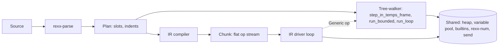

# Phase 4e -- the instruction stream

**Status:** design, revised after review.
**Entry:** **not yet met.** See [Entry](#entry) -- `phase-4d-gate.md` does not exist and 4d-1 is open.
**Blocks:** Phase 5.
**Decided:** 2026-08-08.

## Why this phase exists

The interpreter reaches roughly 0.9 to 1.9 million clauses per second where the C++ oracle spans roughly 3 to 47 million, and the dominant cause is a fixed per-clause overhead rather than anything a clause does.
A spike on branch `spike/bytecode-vm` (commits `d01225d6` and `fce8a6b4`) priced that overhead by running the same workloads through a flat instruction stream with pre-resolved operands.
It measured 27.5 to 4.7 ns per clause on an empty loop against the oracle's 4.9, 93 to 10.3 on `varlookup` against the oracle's 23, and 768 to 628 on `arith` against the oracle's 289.
The win collapses as work per clause rises, which is the signature of a dispatch fix and the reason one data point would have misled.

The second reason is architectural and is why this phase lands **before** Phase 5 rather than after.
A call site in an instruction stream is a stable, patchable slot, which is what makes per-call-site inline caches natural; a tree-walker can hang a cache off an AST node but cannot rewrite the operation itself.
Retrofitting a patchable stream after message sends exist means touching every op and the whole dispatch loop.
The instruction stream is also the shape a later Cranelift or WebAssembly backend would compile from, which turns several of this design's tie-breaks from arbitrary into forced.

## Entry

**The entry condition is not met, and this section says so rather than asserting it.**

`docs/superpowers/plans/` holds gates for phases 2, 3, 4a, 4b and 4c.
`phase-4d-gate.md` does not exist on disk and has never existed in git history.
Writing it is 4d-1's Task 8, and 4d-1 is open.

**4d-1 Task 8 closing is a hard precondition for this phase.**
Without it, exit criterion 4 below points at a document that does not exist.

**One property this phase's ordering was meant to provide is already partly spent, and D20 must not claim otherwise.**
4d-1's plan states at `:18`: "Nothing in this phase optimises anything. … If you find yourself keeping a speedup, stop: that is 4d-2's work and landing it here destroys the bar-before-optimisation property this unit exists to provide."
Five speedups landed on `plan/rust-rewrite` while 4d-1 was open: `3799692d`, `b6b1d8a9`, `e1d50dda`, `c428ec8a`, `04ab4af6`.
Each was measured, and the axis ratios they moved are recorded in their commit messages.
The consequence for this phase is that 4d-1's opening measurement is taken after those landed, so the gate it writes describes the interpreter as it is now, not as it was when 4d-1 was planned.

## Two things called "dispatch"

`2026-08-08-phase-4d-performance-design.md` places `dispatch` out of scope, "to Phase 5".
That is `rust/bench-programs/dispatch.rex`, the **method-dispatch** axis, which needs message sends and stays deferred.
This phase fixes the **interpreter dispatch loop**, which is a different thing with the same name.
Any document that puts the two in one sentence must say which it means.

## What this phase is not

This is not "replace the tree-walker", and it is not "the tree-walker becomes test-only".
Under the delegation design below the tree-walker **ships and executes**: a `Generic` op calls it, and every nested body inside an unpromoted construct runs there.
It is simultaneously the differential oracle and a live component, and both roles are permanent.

## The bar

This phase inherits `phase-4d-gate.md` once it exists rather than writing a second one.
Global Constraints `2026-07-27-rust-rewrite.md:39` is the shipping gate and is unamended here: "slower" means the criterion point estimate falls outside the C++ baseline's confidence interval on the slow side.
That text names **Linux and macOS**, and `:35` requires every phase gate to run on all five platforms.
No measurement described in this spec is multi-host, and whether a macOS measurement is obtainable was already an open question 4d-1 was to answer before writing its gate.
This phase inherits the unanswered question, and [Open questions](#open-questions-for-the-plan) carries it.

## The mandate, correctly stated

The reason for building the IR before Phase 5 is usually stated as "the IR must found OO dispatch".
**Read strictly -- as "the tree-walker must never execute a message send" -- that is unachievable and also incoherent, and both halves matter.**

It is unachievable because any instruction compiled as `Generic` evaluates its operands through `eval.rs`, so a send inside such an instruction executes in the tree-walker.
Driving that to zero means promoting every expression-bearing instruction and every body runner, which is the wholesale reimplementation delegation exists to avoid.

It is incoherent because this phase's own gate runs the whole suite under both engines.
At Phase 5 that suite contains OO programs.
So either the tree-walker executes message sends, or the dual-engine gate silently shrinks to the classic subset at exactly the phase where drift is most likely.

**The dischargeable reading, which this spec adopts.**
Dispatch is implemented **once**, as a shared function -- `send(receiver, selector, args)` -- exactly the shared-semantics discipline every promotion already follows.
The IR gains a `Send` op that wraps that function with a patch-table inline cache.
`eval.rs` and the tree-walker call the same function on its uncached path.
"The tree-walker has message sends" then means it calls the shared function, which is not a second implementation and is the same relationship `run_loop` will have to the extracted loop semantics once loops are promoted.

What the mandate therefore requires of this phase is narrower and checkable: **the hot send sites must be native ops**, not all of them.
[Promotion](#promotion-and-the-minimum-set) names which.

## Architecture

Two engines over one AST.
The parser, `Plan`, the heap, the variable pool, `rexx-num` and every builtin are shared and unchanged.

**Placement in the tree.** A module inside `rexx-exec` (`ir/`), not a new crate.
The compiler needs `Plan`'s slot maps, the driver needs `Interp`'s internals, and promotion extracts shared semantic functions from `run.rs`.
A crate boundary would mean making all of that public in order to cross it.

## Delegation: the boundary is `step_in_temps_frame`

An instruction with no native op compiles to `Generic { index }`, which runs the tree-walker's own clause unit on the original AST node and translates the returned `Flow`.

**The delegation target is `Interp::step_in_temps_frame` (`run.rs:4122`), not `Interp::step` (`run.rs:995`).**
This correction is load-bearing rather than cosmetic.
`step` is not the clause unit: its wrapper carries the clock invalidation for `DATE`/`TIME`, the `>I>` trace-entry decay, `current_value_indent`, the `SIGL` clause line and the clause boundary through `in_clause`, the clause echo for `TRACE A/R/I/L`, the GC temps frame with its watermark tripwire, and failure-site resolution.
`in_clause` (`clause.rs:424-430`) is also where a queued `CALL ON` handler is actually delivered.
`step`'s own arms then *read* state the wrapper set -- `current_value_indent` among them -- so delegating to `step` yields wrong trace indentation on the first clause it touches, no `SIGL` line, no temps frame, and traps that never fire.
The two functions take identical parameters, so the change is one identifier plus making `step_in_temps_frame` `pub(crate)`.

**Consequence: a `Clause` op must not precede a `Generic` op.**
`step_in_temps_frame` already pays the line, the indent and the echo, and the clause echo is not idempotent.
The `Clause` op described under [The IR](#the-ir) applies to **promoted** runs only, and the compiler must enforce that rather than leave it to convention.

**Consequence: the IR driver must replicate what `run_activation`'s loop does and `step_in_temps_frame` does not.**
That is the first-instruction `procedure_permitted` grant with its label-transparency rule (`run.rs:830-833`), which `Activation` records as having `run_activation` as its only writer.
Omit it and every `sub: procedure` becomes error 17.1.
See [Task 0](#the-task-list).

## Engine selection is at body entry

**Selecting the engine only at the program's outer loop would make the gate assert far less than it reads.**
A callee reached from a `Generic` call site, or from an expression, would tree-walk its entire body, so "the suite passes under the IR" could be measuring mostly tree-walker execution.

Selection therefore happens at every body entry:

* `Interp::resolve_and_run_call`'s `run_activation` call (`run.rs:3855`), which is how both `CALL` and an expression's `f(...)` reach a callee.
* `run_fragment`, for `INTERPRET`.
* `deliver_pending_trap` (`run.rs:2893`), whose handler call is `run.rs:2981` -- a trap handler body can be entered from any clause boundary.
* The top-level `execute`.

The switch is driven by an environment variable following the naming shape `corpus.rs` and `assertions.rs` already use (`REXX_CORPUS_GATE`, `REXX_ASSERTIONS_GATE`).
That is a naming convention only: those two encode strict-versus-report, a different axis from which-engine, and this spec does not claim to reuse their mechanism.
**The plan must specify when the variable is read** -- at `Interp` construction or per run -- because unit tests construct `Interp` directly and would otherwise never see it, and **how one `cargo test` invocation produces two runs**.
That harness is what the entire dual-engine gate rests on and it is not yet designed.

## The IR

### Chunk and caching

A `Chunk` is cached the way a `Plan` is: `Interp` already holds `plans: HashMap<BodyKey, Rc<Plan>>` (`lib.rs:1170`), and this phase adds a parallel `chunks` map under the same key, following the same one-upfront-pass discipline D16 decided for plans.

`Rc<Chunk>` is load-bearing rather than incidental.
Cloning the handle out of the map before entering the driver loop is what lets the loop hold the stream while calling `&mut self` methods on `Interp`.
The spike avoided the problem by taking `&Chunk` as a parameter from outside; the real thing cannot, because the chunk lives in the interpreter that the ops mutate.

### Ops

Register-based, with operands resolved at compile time to slot and register indices, and control flow expressed as explicit jumps to op positions.

Register-based rather than stack-based because the operands are already resolved, so a stack would add pushes and pops carrying no information; it is also the form that maps to SSA values without an abstract-stack reconstruction pass.
Explicit jumps rather than recursive body runners because that makes basic blocks derivable from the stream.
Both are justified by this phase's own needs and are additionally what a compiler backend would require.

A `Clause` op carries the source line and the static indent, for promoted runs only.
This is the point of the op existing: the tree-walker searches for both on every clause, and `indent_in_range` was the single largest self-time function in the `rexxcps` profile at 8.0 per cent before the precomputed table landed (`plan.rs:115-119`).

Constants are materialised once at chunk load and rooted for the chunk's life rather than rebuilt per evaluation.
The spike pushes constants as temps and pops only the registers, so its constants are never released; that is harmless in a one-shot driver and becomes a root leak once chunks are cached and re-entered, so the release path is part of this phase rather than inherited.

Index widths are `u32` with a real error on overflow.
The spike's `u16` with `.expect("the spike's programs are small")` is a spike affordance, and Phase 5 runs `CoreClasses.orx`.

### Registers live in the activation's own frame

**The register file cannot be a separate `SlotFrame` pushed above the variable frame.**
`RootSet::grow_slots` asserts that its target is the top frame (`roots.rs:377-385`), and its doc records that the panic "is not a placeholder awaiting a later relaxation".
Run-time slot growth is routine: `Interp::slot_of` grows whenever a name is in neither the plan nor `extra`, which covers `INTERPRET` fragment names, `DROP (v)`, and the first `CALL` in a program that never writes `RESULT`.
A register frame on top turns each of those into an assertion failure.

The spike never hit this because it refuses exactly that case (`vm.rs:244-252`), so there is no spike evidence that a separate frame works, and there is direct evidence that it does not.

**Registers are therefore allocated inside the activation's own frame**, by extending its `push_slots` request to cover the chunk's register count.
Intermediates remain roots the collector already walks, with no per-clause temps frame push and pop, which was the property the separate frame was reaching for.

### The patch table

The op stream stays immutable; a parallel table does not.
A `Vec<AtomicU32>` runs alongside the ops and is read **only inside the arms of ops that can specialise**, so an op that never quickens pays nothing and the extra load never lands in the general dispatch path.

Two properties make this safe in safe Rust and correct later:

* **A patch slot is a hint that never removes a precondition check.**
  The specialised path must re-validate its own precondition and fall through to the general path when it fails.
  For quickened arithmetic that means re-checking that both operands are small integers within `DIGITS` -- the spike already writes exactly that guard inline (`vm.rs:572-578`).
  Without this the invariant is false: a stale "specialised" read on non-small-integer operands would take the specialised path rather than falling back.
  What this property buys is correctness under a racing write; the `Relaxed` load is sound on its own.
* **It survives Phase 6.**
  ooRexx shares routine bodies across activities.
  `Cell<Op>` is not `Sync`, so an in-place-patched stream would need redesigning exactly when concurrency arrives, which is the retrofit this phase exists to avoid.

**The one consumer this phase builds** is quickening an arithmetic op to its small-integer-specialised variant.
Its entry width is `AtomicU32`, sized for an opcode override.
A Phase 5 inline cache holding a behaviour identifier plus a resolved method is wider, and widening it then is expected rather than a defect.

## Promotion and the minimum set

**Promotion is the unit of work.**
A task moves one construct from `Generic` to a native op, extracts the semantics into a function both engines call, and reports a measured axis movement against a predicted one.
The shared-semantics refactor arrives one construct at a time, each paid for by a measured win, rather than as one large unfalsifiable change landing before any speedup does.

**Five arms run whole nested bodies themselves, so leaving them `Generic` hides their bodies from the IR entirely:**

| arm | what it runs internally |
|---|---|
| `If` | true branch through `run_bounded` (`run.rs:1345`) |
| `Select` | matched `WHEN` body, and `OTHERWISE` through `run_otherwise` |
| `Do`/`Loop` | the whole construct, every iteration, inside `run_loop`/`run_repeating` |
| `Interpret` | the fragment, through `run_fragment` |
| `Call` | the callee, through `resolve_and_run_call` |

`IF` deserves a note because its two branches split across engines.
The true path runs `run_bounded` inline; the false path returns `Flow::Goto(false_target)` and the **outer** loop's fallthrough runs the `ELSE` body (`run.rs:1343-1360`).
Semantics are identical either way, since both routes reach `step_in_temps_frame` per instruction, but it means an unpromoted `IF` executes half in each engine.

**The minimum promotion set for the mandate**, in the dischargeable reading above:

* **Expression evaluation, including a native invoke op**, replacing the route through `eval_call` (`eval.rs:474`) and `resolve_and_run_call`.
  This is the shape a `Send` op generalises, and omitting it was the largest gap in an earlier draft of this spec's stopping rule.
* **`If` and `Select`**, or their branch bodies stay tree-walker positions.
* **`Do`/`Loop`**, or every loop body position is invisible to the IR.
  This is also the promotion without which no benchmark moves, so it is first in time as well as mandatory.
* **Body entry dispatching through the engine switch**, so a callee runs as a chunk.
* **At Phase 5**, the message-send instruction and the `~` expression compile native from the start and never acquire a `Generic`-only existence on the hot path.

**What may remain delegated** without defeating the mandate: `INTERPRET`, trap handler delivery, `PARSE`, `ADDRESS`, `OPTIONS`, `TRACE`, `DROP`, `NUMERIC` and the rest of the expression-bearing residue.
Their sends reach the shared function on its uncached path, which is correct and merely slower.

**An unpromoted construct is slower under the IR than under the tree-walker**, by one indirection.
Intermediate states of this phase are not uniformly faster.
That is a predicted property of the design and not a regression to investigate.

## Coverage, and what D21 does and does not claim

**Every instruction compiles. Nothing refuses.**

**D21's justification is incrementality and the drift gate, not the mandate.**
An earlier draft justified total coverage by claiming that an excluded construct would fall back to the tree-walker and defeat the mandate.
That argument is self-defeating: `Generic` **is** a fallback to the tree-walker, and the design celebrates the fact that an unpromoted construct runs literally the same code.
What total coverage actually buys:

* **The drift detector has full reach from task one.**
  Every existing test runs under the IR immediately.
  Under refusal the test population grows *with* coverage, so it is smallest exactly when the engine is least trustworthy.
* **Promotion moves one variable.**
  Before a promotion the construct's behaviour is the tree-walker's code; after, it is the native op, and the differential isolates that one construct.
  Under refusal, promoting also changes which programs are accepted, so two things move at once and neither is attributable.
* **The residual dependency on the tree-walker is enumerable rather than diffuse.**
  Not "some programs fall back" but "these op positions delegate", which is what turns the minimum promotion set into a checkable claim.
* **A refusal list would institutionalise the defect `rust/CLAUDE.md` documents.**
  An exclusion set of unsupported constructs is a mutable in-repo aggregate described in prose, the class that rots; it would also make "the IR is the default" unfalsifiable, since default for which programs would be unstated.

**Coverage is total at the driver level, and execution coverage is not.**
For an all-`Generic` program the IR contributes an outer loop and everything else is tree-walker code.
Any criterion phrased as "runs on the IR" must say which of the two it means.

## The dual-engine gate

The gate is the whole test suite under both engines: unit tests, the differential corpus runner, the trace oracle, the extracted assertion tables.
The suite runs twice and must produce identical results.
Stated as a property rather than a number of tests, because `rust/CLAUDE.md` identifies counts of mutable in-repo aggregates in prose as the class that rots.

Two comparisons run, catching different things:

* **IR against tree-walker**, internally, across the whole suite -- the drift detector.
* **IR against the C++ oracle**, through the existing `corpus.rs` runner, unchanged -- what both engines get wrong together, which the first comparison structurally cannot see.

**The compiler needs a test path the differential cannot provide.**
`Generic` masks compiler defects by construction: a compiler that emits a wrong op for a promoted construct and `Generic` for everything else is indistinguishable from a correct one on any program that never reaches the wrong op.
So each promotion carries golden op-stream tests for the construct it promotes, and an all-`Generic` versus promoted A/B on the same program.

## INTERPRET

A fragment compiles to its own chunk at run time, which is what any bytecode language with an `eval` does.

`Interp::fragment_plan` (`plan.rs:626`) resolves the fragment's names against the enclosing frame and returns a `HashMap<SymbolId, usize>`, which is the parameter shape the spike's compiler already takes.
It builds a `Plan` internally through `Plan::build` -- which runs `all_indents` -- and discards the indent table, and the fragment's `Code` carries `indents: None`, so `printed_indent` re-walks with `static_indent` per clause.
The chunk compiler takes the indents from that existing computation rather than making a third.

**Caching fragment chunks is not decided here, and D16 is why.**
D16 (`2026-07-30-phase-4a-executor-design.md:215`) decided that an interpreted fragment's plan is *not* cached, because "any per-parse key misses every lookup while retaining every entry, and `do 1000000; interpret s; end` would accumulate a million dead plans", leaving text-keyed caching to a later phase "and only if it can show a hit rate".
Keying on text fixes the miss-rate half and not the retention half.
The plan must name a retention bound and a hit-rate threshold, or decline to cache.

## Trace

**Clause line numbers are semantics and are not negotiable.**
They feed `SIGL`, condition objects and syntax error messages.
`TRACE()` returning the current setting is semantics.
Interactive trace reads standard input and executes what it is given.

**Trace echo text is a different matter, and changing it has a price worth stating before anyone spends it.**
ooRexx's own suite asserts echo: `ootest/ooRexx/base/keyword/TRACE.testGroup` captures `.TraceOutput` into an `ArrayStream` and compares it against embedded `::resource` blocks, on 34 lines calling `self~assertTraceOutput`.
That is L3-core, gated at Phase 9.

Three qualifications, because an overstated cost is as misleading as a missed one:

* **The comparison is strict but not byte-for-byte.**
  `assertTraceOutput` is defined in the testGroup itself, not in the ooTest framework, and it normalises: it drops a trailing `trace off` line, asserts line counts, rewrites relative line numbers to absolute, ignores the trailing package name on `>I>`/`<I<` method lines, and strips trailing blanks from the actual side.
* **Most but not all of it is intermediate-level.**
  Of the 34 assertions, most set `trace i` inline or in dynamically built code, and **one uses `trace ?a`, interactive ALL**.
  The group's header comment describes regenerating the resources with `::options trace i`, but that is an offline procedure rather than how the tests set trace at run time.
* **`TRACE_TraceObject.testGroup` is not a second source of echo assertions.**
  It sits in the same directory and tests the `.TraceObject` API; it contains no `assertTraceOutput` and no `ArrayStream`.

**Where `ootest/` comes from matters for anyone re-checking this.**
It is an SVN working copy, untracked in git, and it is **not** in the C++ oracle tree at `/home/moritz/dev/repos/ooRexx`, which has no `ootest/` at all.

**Intermediate-level trace cannot survive an optimiser.**
`trace i` echoes intermediate results, and common-subexpression elimination or constant folding deletes the intermediates.
A design promising both is promising something impossible.

**The rule: the trace setting is an input to compilation, not a choice of engine.**
One engine, two chunks.
The nine accepted letters are A, C, E, F, I, L, N, O and R, enumerated externally in `TraceSetting::parseTraceSetting` and independently in `TRACE.testGroup`, which loops over `"acefilnor"`.
The table is total over them:

| setting | what is observable | what may be optimised |
|---|---|---|
| `N`, `O` | nothing | everything |
| `A`, `C`, `L` | clause echo | anything within a clause; clause boundaries must survive |
| `E`, `F` | a clause echoed conditionally on a command's return | as `A`/`C`/`L`: the clause and its command result must survive |
| `I`, `R`, interactive | intermediate results | nothing; compile unoptimised |

Keeping it one engine matters: if traced programs ran on the tree-walker rather than on an unoptimised chunk, traced programs would take a permanently different code path from untraced ones, which is the divergence this design exists to avoid.

`TRACE` is dynamic -- `TRACE VALUE expr` exists and the setting changes mid-program -- so the level is not known at compile time.
Compile optimistically and recompile that body unoptimised when the setting rises above what the chunk can serve.

**This phase builds none of that.**
Its only optimisation is quickening an arithmetic op to a small-integer variant, which produces an identical value by an identical sequence of intermediates.
This phase is trace-neutral by construction, its promotion tasks run the trace oracle, and a moved clause boundary is a bug in this phase rather than a licensed divergence.
The rule is recorded so the first pass which is **not** trace-neutral has somewhere to look, instead of discovering the conflict at Phase 9.

## What this phase does not build

No `Send` op, no behaviour identifier on a cache slot, no selector table, no receiver in the calling convention.
Those are Phase 5's, built against a patch mechanism that by then has a working consumer.

Forward constraints recorded so Phase 5 is additive:

* Selectors will want interning at compile time, the way variable slots already are.
* `ObjRef::decode()` already separates `SmallInt`, `Nil` and `Heap`, and `SmallInt` needs a behaviour arm rather than a heap lookup.
* The register file and calling convention need to carry a receiver alongside the arguments.
* The patch table's entry widens from `AtomicU32` when a cache holds more than an opcode override.

These belong in this spec.
They deliberately do **not** go into code comments, per `rust/CLAUDE.md`'s rule against narrating abstractions that belong to a future change.

## Measurement discipline

This phase reuses 4d-1's harness and bars rather than inventing a second discipline.

* Interleave between binaries within one loop and take per-binary minima.
  Two runs of a suite minutes apart are not comparable at the few-percent level; reading across two runs once invented a 5 per cent regression here that was really a 5 per cent improvement.
* Report absolute throughput alongside ratios, because a ratio hides its denominator.
* Assert the oracle fingerprint, per 4d-1's rule.
* Each promotion task names the axes it predicts it will move and by how much.
  A task whose measured result matches nothing is a recorded finding about the model, not a silently-landed change.
* A speedup claim is falsified like a bug fix: revert it and show the number moves back.

**The no-regression rule needs a scope, because two statements in this spec otherwise contradict.**
An unpromoted construct is slower under the IR, and at the exit gate the IR becomes the default.
So: **no committed suite result regresses under the tree-walker arm**, which stays measurable throughout via the engine switch.
The IR arm is measured against the promotion predictions, and an IR-arm figure below the tree-walker's on a still-delegated construct is expected rather than a gate failure.

**The spike's figures are not reproducible as they stand, and the stopping rule cannot be anchored to them without repair.**
They exist only in commit prose: there is no bench-results file, no harness script, no oracle build identity, and no surviving program for the headline empty-loop workload.
`rust/bench-programs/` holds alloc, arith, compound, dispatch, heapshape, startup, strings and varlookup, and no empty loop.
The plan's first measurement task therefore re-establishes the spike's three data points on the committed harness with a build identity, and the stopping rule below is stated against **those** numbers.

Two further precision notes on the spike, so it is not over-cited:

* It pays the per-clause *checks* and refuses the *work*: it aborts when `tracing_clause` is true, when a trap is pending, and when trace intermediates are on (`vm.rs:531-536, 557-559`).
  It therefore cannot run under any trace setting, which is the axis this spec's trace section reasons about.
* **It has no `Generic` op and never calls `step`.**
  The mechanism this phase's entire coverage and promotion strategy rests on is the one part of the design with no spike evidence behind it, and `vm.rs` has no unit tests.

## The task list

Ordering is a dependency, not a preference.

* **Task 0 -- the driver.**
  Extract `run_activation`'s loop obligations into a form both engines use, and make `step_in_temps_frame` `pub(crate)`.
  That loop is semantics, not plumbing: the first-instruction `procedure_permitted` grant with its label-transparency rule (`run.rs:830-833`), the trap offer positioned so a nested `run_bounded` does not get a second one, the three program-counter writes, and the 28.1 to 28.4 `LEAVE`/`ITERATE`-reached-the-top family which `run_fragment` already duplicates.
  Without this task the IR driver is a second copy of that loop from day one, which no amount of shared-semantics discipline in later tasks would undo.
  Nothing else can start.
* **Task 1 -- the pinned `Op` enum and `Chunk` definition**, owned by one task, with an explicit rule that later tasks extend rather than reshape.
  `Chunk` holds at minimum the ops, the constants, the two index maps, the register count, whatever handle a `Generic` op needs to reconstruct `step_in_temps_frame`'s arguments, and the `ProgramSource`.
  This task also fixes the register allocation discipline: who allocates, whether a register is per-instruction scratch or lives across ops, and how a promoted construct declares its need.
  The spike's whole-chunk high-water mark does not survive nesting.
* **Task 2 -- the index maps and the `Flow` translation contract.**
  `Flow` has **seven** variants (`run.rs:94-238`): `Next`, `Goto(usize)`, `Exit`, `Return`, `Leave`, `Iterate` and `Signal(usize)`.
  `Goto` and `Signal` are **different index spaces**: `resolve_signal_target` resolves against the *activation's* body, which inside an `INTERPRET` fragment is a different `Code` from the one being stepped, and `Flow::Signal`'s own doc records that reusing `Goto` for it "does not always fail, which is exactly why this needed a program built to collide".
  So two total maps, not one.
  `Goto` targets can also be one past the end, and `run_bounded`'s absorption guard is inclusive, so the map needs an entry at `index == instructions.len()`.
  This task also writes the `Leave`/`Iterate` contract at the engine boundary: when a native `DO` op consumes a `Flow::Leave` raised inside a `Generic` region, who pops the search frame and resets `LeaveOrigin`'s indent.
  `LeaveOrigin`'s doc records that a wrong rule here fit every probe behind it and was falsified on 7 of 14 shapes by a purpose-built set, which makes this the highest-risk boundary in the phase.
* **Task 3 -- the engine-selection harness**, including the four body-entry points above, when the variable is read, and how one test invocation yields two runs.
* **Task 4 -- re-establish the spike's three data points** on the committed harness with a build identity.
* **Tasks 5 and on -- one promotion each**, in the order `Do`/`Loop`, `If`/`Select`, variable access, arithmetic and its quickening consumer, then expression evaluation with its native invoke op.
  Each names the axes it predicts and by how much, and carries golden op-stream tests plus an all-`Generic` versus promoted A/B.

**The compile error path is a decision Task 1 owns.**
Index overflow is a real error, and "every instruction compiles, nothing refuses" is the coverage rule.
Falling back to the tree-walker on a compile error would contradict the coverage rule; failing loudly is the choice this spec expects, and Task 1 states it either way.

## Exit gate

Each criterion carries what it cannot see and how it is falsified, following `phase-4c-gate.md`'s form.

**1. Both engines agree across the whole suite, and the IR is the default at every body entry.**

> Every test passes under both engines, and the engine switch defaults to the IR at all four body-entry points.

*Cannot see:* whether the IR arm actually executed IR ops, since an all-`Generic` program satisfies this while running tree-walker code throughout.
Criterion 6 is what closes that.
*Falsification:* a harness assertion that the IR arm's run list is derived from the same source as the tree-walker arm's, in the shape `the_differential_reads_every_phase_subset_file` already uses, so an arm that silently skips a harness goes red rather than passing with a shrunken denominator.

**2. The corpus differential against the C++ oracle does not regress.**

*Cannot see:* anything both engines get wrong together.
*Falsification:* the existing `corpus.rs` runner in STRICT mode.

**3. `samples/rexxcps.rex` runs on the IR and its output matches the oracle.**

*Cannot see:* speed.
Criterion 4 covers that.
*Falsification:* byte comparison of stdout and exit status; a build that exits 0 having done nothing fails it.

**4. Every axis meets its bar in `phase-4d-gate.md`, or a shortfall is recorded as a named debt that names the task discharging it.**

*Cannot see:* whether the debt is ever discharged.
*Falsification:* a bound the plan must set on how many axes may be debt.
Without such a bound this criterion is satisfied by any outcome, since recording a shortfall is always possible, and an earlier draft's "it is not a lowered bar" was a pre-emption rather than a mechanism.

**5. The patch table has a working consumer: quickened small-integer arithmetic, with a measured win that reverts.**

*Cannot see:* whether the specialised path re-validates its precondition.
*Falsification:* a test driving the quickened op with operands outside the small-integer range and asserting the general path's answer.

**6. The minimum promotion set is native.**

> `Do`/`Loop`, `If`/`Select`, variable access, arithmetic and expression evaluation including the invoke op compile to native ops, and no `Generic` op remains on a path Phase 5 dispatches through.

*Cannot see:* whether Phase 5's own dispatch is fast, which is Phase 5's gate.
*Falsification:* an assertion over the compiled op stream of every corpus program, not inspection.
Without this criterion the phase could close with expression evaluation still delegating, which would not discharge the mandate it exists for.

**7. The trace oracle passes.**

*Cannot see:* trace behaviour under settings the suite does not exercise.
*Falsification:* the existing trace oracle harness.

The master plan's Phase 4 row closes when this phase closes.
Landing this phase edits **two** lines there: the roadmap row at `:442`, which reads "Classic executor, split 4a / 4b / 4c / 4d", and `:473`.
`:473` was already amended once by commit `64ee0369`, as 4d-1's Task 1, so this is a second amendment to that line rather than the first.
`:459`'s S0 entry is deliberately left alone.

## Risks and the stopping rule

* **Loop promotion is the largest single task and the highest risk.**
  `run_loop` dispatches all six `LoopKind` variants (`rexx-parse/src/ast.rs:986-1009`), `run_repeating` drives the repetition, and `WHILE`/`UNTIL` are an orthogonal `Loop.conditional` field threaded through both rather than kinds of their own.
  Add the `LEAVE`/`ITERATE` label search and the per-step control-variable re-read from the variable pool that a reviewer already caught once as a false unreachability claim.
  Two constructs need naming rather than assuming: `LoopKind::With` is not carried by `run_loop` today, and `LoopKind::Over` exists only as the documented Deviation 1 single-iteration form, so promoting `OVER` promotes a deviation.
* **The `Flow` boundary is the subtlest defect surface**, per Task 2.
* **Two implementations of one semantics is a standing drift risk.**
  The countermeasures are the whole suite under both engines, promotion extracting shared functions rather than writing second copies, and the golden op-stream tests that the differential alone cannot provide.

**Stopping rule.**
After `Do`/`Loop`, `If`/`Select`, variable access and arithmetic are promoted, if the measured axis movement is materially below Task 4's re-established figures, this phase re-plans rather than continuing to promote.
The plan sets the threshold "materially" stands for; this spec declines to, because a threshold invented before Task 4 re-measures would be anchored to numbers that currently exist only in commit prose.
The shape is the model -- a large win where the clause does little, collapsing as work per clause rises -- and a promotion sequence not reproducing that shape means the model is wrong, which is a finding rather than a reason to try harder.

## Decisions recorded here

* **D20.** The IR lands as Phase 4e, entered after 4d-1's Task 8 writes `phase-4d-gate.md`.
  4d-2 keeps the non-IR causes: allocation, string representation and `rexx-num`'s scratch buffers.
  The bar-before-optimisation property this ordering provides is already partly spent, per [Entry](#entry), and D20 does not claim otherwise.
* **D21.** Coverage is total: every instruction compiles and nothing refuses, justified by incrementality and the reach of the drift gate.
  It is **not** justified by the mandate, and an earlier draft's argument that it was is withdrawn as self-defeating.
  Coverage is total at the driver level; execution coverage grows only with promotion.
* **D22.** The op stream is immutable and patch state lives in a parallel atomic table whose entries are hints that never remove a precondition check.
  Quickening small-integer arithmetic is the one consumer this phase builds, at `AtomicU32`.
* **D23.** The trace setting is an input to compilation.
  Divergent trace output is licensed only from the first optimising pass that is not trace-neutral, and its price is ooRexx's `assertTraceOutput` assertions at Phase 9.
* **D24.** Method dispatch is implemented once, as a shared function.
  The IR's `Send` op wraps it with an inline cache; the tree-walker and `eval.rs` call its uncached path.
  The mandate is discharged by making the hot send sites native, not by eliminating tree-walker execution.

## Open questions for the plan

* **macOS.** The inherited gate names Linux and macOS and no measurement here is multi-host.
  4d-1 was to answer this before writing its gate; this phase inherits the question unanswered.
* **The retention bound for fragment chunk caching**, or a decision not to cache, against D16's recorded reasoning.
* **The threshold "materially" stands for** in the stopping rule, set after Task 4 re-establishes the spike's figures.
* **The bound on how many axes may close as debt** under exit criterion 4.
