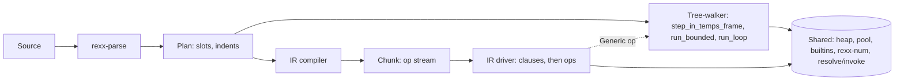

# Phase 4e -- the instruction stream

**Status:** design, revised after two reviews and a mechanics spike.
**Entry:** **met.** Phase 4d-1 closed 2026-08-09; `phase-4d-gate.md` exists.
**Blocks:** Phase 4f (the optimisation loop) and Phase 5.
**Decided:** 2026-08-08, re-sequenced 2026-08-09.

## Why this phase exists, and why it is not justified by a ratio

**The IR is a foundation, not a speedup.**
Its reasons are architectural and each of them is prior to, and independent of, any benchmark number:

* **It founds OO dispatch.** A call site in an instruction stream is a stable, patchable slot, which is what makes per-call-site inline caches natural. A tree-walker can hang a cache off an AST node but cannot rewrite the operation itself. Retrofitting a patchable stream after message sends exist means touching every op and the whole dispatch loop. This is Phase 5's dependency, not 4f's.
* **It is the shape a compiler backend consumes.** A flat stream with explicit jumps and pre-resolved operands has derivable basic blocks and maps to SSA without an abstract-stack pass; `Generic` is already the bailout edge a compiled function needs. Cranelift or WebAssembly become reachable questions rather than rewrites.
* **It makes trace an emission decision rather than a mode flag**, which is what D23 needs and what the spike showed is a correctness requirement once expressions are promoted.
* **It gives quickening and specialisation somewhere to live**, which the tree-walker structurally cannot.

**This matters for what the IR is allowed to be optimised for.**
Phase 4f's parity bar is a constraint the IR must also satisfy; it is **not** the reason the IR exists. A design tuned to move five benchmark ratios would take different decisions from one built to carry message sends, a compiler backend and a trace regime -- and the second is what this phase is for. Where the two pull apart, the foundation wins and the ratio is 4f's problem.

**The re-sequencing, and why.**
This phase previously sat after Phase 4d and blocked on its gate. That ordering is withdrawn. Anything that restructures the interpreter has to land **before** the phase gate closes, or the performance work becomes a patch on top of something already certified. Since 4d-1's own conclusion is that the seven attributed causes cannot reach parity, and the IR is the only specified structural candidate, the IR precedes the optimisation loop. See `docs/superpowers/plans/2026-08-09-phase-4f-optimisation-loop.md`.

**What that ordering does not claim.**
It does not claim the IR closes the gap. The `spike/bytecode-vm` figures are withdrawn, the mechanics spike measured **no** speedup, and no reproducible anchor exists until chunk caching and loop promotion do. The IR is built for the reasons above; this phase owes only that it not leave the benchmark axes slower, and whether the ratios actually move is 4f's question under 4f's rules.

Every mechanism below that a spike settled is marked with its commit on branch `spike/ir-mechanics` (worktree `/home/moritz/dev/repos/ooRexx-ir-spike`, findings in `docs/superpowers/plans/phase-4e-spike-findings.md`).
Claims not so marked are design intent and have not been run.

## What is established, and what is withdrawn

**The performance argument is weaker than earlier drafts of this spec claimed, and the numbers behind it are withdrawn.**

An earlier prototype on branch `spike/bytecode-vm` measured 27.5 to 4.7 ns per clause on an empty loop, 93 to 10.3 on `varlookup`, and 768 to 628 on `arith`.
Those figures were taken on a design that the mechanics spike has since shown cannot run:

* it put the register file in a separate `SlotFrame`, which makes `grow_slots` panic on the frame beneath it (`4b285394`), so it cannot execute a `CALL`, an `INTERPRET` or a `DROP`;
* it refused to run under any trace setting, and paid neither the temps frame, nor failure-site resolution, nor the clause echo -- all of which are obligations rather than options (`5e99f526`, `70b1c5cc`);
* it used one flat loop, where `in_clause`'s scope forces two levels (`5e99f526`).

**What survives is the shape, not the magnitude.**
The win collapsing as work per clause rises is the signature of a dispatch cost, and that is the reason to keep going.
The only clean A/B run since -- a promoted clause unit against the tree-walker's, on the same driver -- showed the promoted side **slower**, and was itself unreliable for reasons [Measurement](#measurement-and-the-missing-anchor) records.

**No measurement currently shows this phase's engine faster than the tree-walker.**
Task 1 exists to fix that before anything is decided against it.

## Entry

**Met, 2026-08-09.** Phase 4d-1 closed with all eight tasks complete, and `phase-4d-gate.md` exists at commit `c790e3a7`.

**What this phase now blocks.** Phase 4f, the optimisation loop, which cannot begin until the structural change has landed -- otherwise it tunes code the IR replaces. And Phase 5, which needs the patchable call site.

**What 4d-1 handed forward that binds this phase.** Its own conclusion is that the seven attributed causes, landed perfectly on every axis, do not reach parity anywhere; the best derived bar is 1.62x. That is why a structural change is sequenced at all, and it is the reason this phase exists in the schedule even though its own justification is architectural.

**What 4d-1's measurement discipline hands forward, and what it does not.** `phase-4d-gate.md`'s 7.2% undecidable band is **withdrawn**, not re-derived: Phase 4f replaced it with an escalation rule that spends measurement only where a ratio lands near 1.0. This phase's own comparisons are between two engine arms of one build, where the paired rule applies and no absolute band is needed. Its stopping rule is still stated against figures Task 1 re-establishes rather than against the withdrawn prototype numbers.

**The bar-before-optimisation property this ordering was meant to provide is already partly spent.**
4d-1's plan states at `:18`: "Nothing in this phase optimises anything. … If you find yourself keeping a speedup, stop."
Five speedups landed on `plan/rust-rewrite` while 4d-1 was open: `3799692d`, `b6b1d8a9`, `e1d50dda`, `c428ec8a`, `04ab4af6`.
So 4d-1's opening measurement describes the interpreter as it is now, not as it was when 4d-1 was planned, and D20 does not claim otherwise.

## Two things called "dispatch"

`2026-08-08-phase-4d-performance-design.md` places `dispatch` out of scope, "to Phase 5".
That is `rust/bench-programs/dispatch.rex`, the **method-dispatch** axis, which needs message sends and stays deferred.
This phase fixes the **interpreter dispatch loop**, a different thing with the same name.

## What this phase is not

Not "replace the tree-walker", and not "the tree-walker becomes test-only".
Under delegation the tree-walker **ships and executes**: a `Generic` op calls it, and every nested body inside an unpromoted construct runs there.
It is simultaneously the differential oracle and a live component, permanently.

## The bar

**This phase does not inherit `phase-4d-gate.md`'s parity bars, and the re-sequencing is why.**
Those bars are Phase 4f's exit condition, and 4f runs *after* this phase.
Gating 4e on them would either make 4f unreachable or make it redundant, and 4e's own promotions are not the changes the parity bars were derived to measure.
What this phase owes the gate document is an **input state**: the axis ratios re-measured under both engines, as the position 4f's loop starts from.

**What this phase does own is a floor, and it can fail.**
The IR arm must not be *slower* than the tree-walker arm on the benchmark axes, because the minimum promotion set covers what those axes execute, and a structural change that leaves 4f starting from a worse position has not paid for itself.
The spike's one clean A/B put the promoted side slower, so this is a live outcome rather than a formality.
[Exit gate](#exit-gate) criterion 4 states it as a criterion.

Global Constraints `2026-07-27-rust-rewrite.md:39` is unamended here: "slower" means the criterion point estimate falls outside the C++ baseline's confidence interval on the slow side.
That text names **Linux and macOS**, and `:35` requires every phase gate to run on all five platforms.
No measurement described here is multi-host, and no platform runs the Rust suite automatically today.
Both are carried in [Open questions](#open-questions-for-the-plan) rather than assumed away.

## The mandate, correctly stated

Read strictly -- "the tree-walker must never execute a message send" -- the mandate is unachievable and also incoherent.

Unachievable, because any instruction compiled as `Generic` evaluates its operands through `eval.rs`, so a send inside it executes in the tree-walker.
Driving that to zero means promoting every expression-bearing instruction and every body runner, which is the wholesale reimplementation delegation exists to avoid.

Incoherent, because this phase's own gate runs the whole suite under both engines.
At Phase 5 that suite contains OO programs, so either the tree-walker executes message sends or the gate shrinks to the classic subset exactly where drift is most likely.

**The dischargeable reading, adopted here.**
Dispatch is implemented once as shared functions, and the IR's `Send` op caches the resolution half.
See [D24](#decisions-recorded-here), which the spike amended: the shared surface is `resolve` **and** `invoke`, not one fused `send`.

What the mandate requires of this phase is narrower and checkable: **the hot send sites must be native ops**.
[Promotion](#promotion-and-the-minimum-set) names which.

## Architecture

Two engines over one AST.
Parser, `Plan`, heap, variable pool, `rexx-num` and every builtin are shared and unchanged.

**Placement.** A module inside `rexx-exec` (`ir/`), not a new crate.
The compiler needs `Plan`'s slot maps, the driver needs `Interp`'s internals, and promotion extracts shared functions from `run.rs`.
The spike required widening eight `run.rs` methods to `pub(crate)`; a crate boundary would mean making all of it public.

## The driver

### Its obligations are semantics, and two of them extract (`614388fc`)

`run_activation`'s loop carries, per instruction: the first-instruction `PROCEDURE` permission with its label-transparency rule, the trap offer, the program-counter writes, and the 28.1-28.4 exhausted-search family.
A second driver written beside it is a second copy of all four.

`grant_procedure_permission(instruction)` and `apply_flow(code, flow) -> Result<Option<Ended>, Failure>` extract cleanly and both engines now call them.
**The trap offer stays at the call site deliberately**: its position *is* the semantics -- one offer per activation, made by the activation that is unwinding -- and moving it inside would give a nested `run_bounded` a second offer.

**One shared driver does not cover every boundary.**
`run_fragment`'s own `Leave`/`Iterate` arms are the same event at a different boundary: same four constructors and the same `record_leave_failure` call, but they resolve the name against the *fragment's* symbol table, which is the last point at which the interned id means anything, and they `seal_site_level` first.
An engine wanting this behaviour at a third boundary must re-read it rather than assume.

### It is two levels, not one flat loop (`5e99f526`)

`in_clause(code, line, body)` is a **scoped closure**: it sets the clause line, runs the whole clause, and then -- only on the success path -- delivers a queued `CALL ON` handler, which can end the program.
A clause spans a run of ops and a flat stream has no scope to hang that on.

So the outer loop iterates **clauses** and the closure runs that clause's own ops.
One level of nesting, driven by op indices rather than recursion, against the tree-walker's five layers.
Earlier drafts' "one flat dispatch loop" is withdrawn.

### The program counter stays an instruction index (`70b1c5cc`)

`Flow::Goto` and `Flow::Signal` both carry instruction indices, and they resolve against different bodies -- `Signal` against the *activation's*, which inside an `INTERPRET` fragment is not the body being stepped.
Keeping the activation's `pc` in that space and mapping through the chunk's instruction-to-op table at the top of each clause means **`apply_flow` is reused unchanged and the two index spaces never have to be reconciled**.
An earlier draft's requirement for two maps is withdrawn: there is one map, from instruction index to op index, total over the body plus one entry at `len`, because `run_bounded`'s absorption guard is inclusive and a construct's resume point can be one past the end.

## Delegation

An instruction with no native op compiles to `Generic`, which runs the tree-walker's clause unit on the original AST node.

**The delegation target is `Interp::step_in_temps_frame`, not `Interp::step`.**
`step` is not the clause unit: its wrapper carries the clock invalidation, the `>I>` trace-entry decay, `current_value_indent`, the `SIGL` clause line and the clause boundary through `in_clause`, the clause echo, the GC temps frame with its watermark tripwire, and failure-site resolution.
`in_clause` is also where a queued `CALL ON` handler is delivered.
`step`'s own arms then read state the wrapper set, so delegating to `step` yields wrong trace indentation on the first clause it touches, no `SIGL` line, no temps frame, and traps that never fire.

**A `Clause` op must not precede a `Generic` op**, because `step_in_temps_frame` already echoes and the echo is not idempotent.
Making trace explicit ops is what turns that from an unassertable convention into something visible in the stream -- see [Trace](#trace).

**The `Generic` payload is an instruction index and nothing else.**
Reconstructing `Code` while holding `&mut self` is already solved: `run_activation` clones the `Rc<Program>` and `Rc<Plan>` into locals and builds `Code` from those, so it outlives every `&mut self` call. The driver does the same once per chunk-run.

## The IR

### Chunk and caching

A `Chunk` is cached as a `Plan` is: `Interp` holds `plans: HashMap<BodyKey, Rc<Plan>>`, and this phase adds a parallel `chunks` map under the same key, following the discipline D16 decided for plans.
`Rc<Chunk>` is load-bearing: cloning the handle out before entering the driver is what lets the loop hold the stream while calling `&mut self`.

**Caching is not optional, and the spike proved why.**
Its driver compiled per activation entry, which fused compile cost with execution and made the clause-unit measurement unresolvable.

### The clause op carries only its extent (`70b1c5cc`)

Built carrying an instruction index, a line and an indent. **All three went unread.**

The activation's `pc` already addresses instructions, so a clause reaches its own AST node through the map it was found by.
And a precomputed line and indent cannot replace `clause_line` and `printed_indent`, whose fallbacks -- `clause_state.line()`, and a fragment's absent indent table -- are exactly the cases a memo gets wrong.

**A promoted clause needs *access* to its instruction, not a copy of its coordinates.**
It still reaches the AST: `clause_site` for the echo text, `record_failure_site` for the failing clause, `clause_line` for the line, and `assign_expr_target` for a store's target.
Full independence from the AST is not available while trace echo and failure sites are byte-compared against the oracle.

### Registers live in the temporaries stack (`4b285394`)

**Both earlier designs are withdrawn.**
A register `SlotFrame` of its own makes `grow_slots` on the variable frame beneath it panic, and that assertion is deliberate; a program reaches the growth on `INTERPRET` introducing a name, on `DROP (v)`, and on the first `CALL` in a program that never writes `RESULT`.
Extending the activation's `push_slots` request reaches none of the cases that matter, because they push no frame at all: `CALL label` reuses the caller's frame outright, `INTERPRET` pushes nothing, and a `CALL ON` handler enters through the same label path. `PROCEDURE` then swaps the frame mid-body.

Registers are an indexable region of the temporaries stack (`reserve_temps`, `temp_at`, `set_temp`).
Temps are independent of slot frames, already roots the collector walks, and they nest -- which a fragment chunk compiled inside a running chunk needs.
The stack also carries no balance assertion by decision, so watermark-truncate survives a condition unwinding through a chunk.

### The patch table

The op stream stays immutable; a parallel `Vec<AtomicU32>` does not, read **only inside arms of ops that can specialise**, so an op that never quickens pays nothing.

* **A patch slot is a hint that never removes a precondition check.** The specialised path re-validates and falls through. For quickened arithmetic that means re-checking both operands are small integers within `DIGITS`.
* **It survives Phase 6.** ooRexx shares routine bodies across activities; `Cell<Op>` is not `Sync`.
* **The schema does not generalise to sends**, which [D22](#decisions-recorded-here) now says explicitly.

## Trace

**Clause line numbers are semantics**: they feed `SIGL`, condition objects and syntax error messages. `TRACE()` returns the current setting. Interactive trace reads standard input and executes what it is given.

**Trace echo text is asserted by ooRexx's own suite.**
`ootest/ooRexx/base/keyword/TRACE.testGroup` captures `.TraceOutput` into an `ArrayStream` and compares against embedded `::resource` blocks, on 34 lines calling `self~assertTraceOutput`. That is L3-core, gated at Phase 9.
Three qualifications: the comparison normalises rather than being byte-exact (it drops a trailing `trace off` line, asserts line counts, rewrites relative line numbers, ignores the trailing package name on `>I>`/`<I<` lines, strips trailing blanks); most but not all of the assertions are intermediate-level, with exactly one using `trace ?a`; and `TRACE_TraceObject.testGroup` contains no echo assertions at all.
`ootest/` is an SVN working copy, untracked in git, and **not** in the C++ oracle tree.

**Intermediate trace cannot survive an optimiser**: `trace i` echoes intermediate results and CSE or folding deletes them.

### Trace becomes explicit instructions in the stream

The concrete realisation of D23.

**What it buys.** It makes "one engine, two chunks" a visible difference in the op stream rather than a mode flag threaded through every arm; it makes who pays the echo visible instead of an unassertable convention; it makes trace testable where nothing tests it today (`tests/support/mod.rs` normalises at `PREFIX_OFFSET` 7..10 and collapses the space run that carries nesting indent, so no corpus instrument can see a trace indent); an untraced chunk then pays nothing at all, not even a flag test per clause; and explicit ops are schedulable and elidable by a Cranelift or wasm backend where side effects in a runtime helper are opaque.

**What it cannot reach.** The clause *line* is semantics rather than trace, so the clause op splits into an unconditional half and a conditional half rather than becoming elidable. `TRACE` is dynamic (`TRACE VALUE expr`, mid-program `trace`, inheritance across activations), which relocates the deopt problem rather than solving it. Interactive trace is control flow, not an emit. And intermediate trace lives inside expression evaluation, so under `Generic` the two regimes coexist until expressions are promoted.

**It is a correctness requirement, not a performance idea, and the spike proved it (`70b1c5cc`).**
Under `trace i` a promoted assignment **dropped the literal's `>L>` line**, because `eval.rs` emits it as a side effect of evaluating and a native `Const` op does not.
Every following line still matched, so only an exact stderr comparison sees it -- and no corpus instrument here does.
**Promoting an expression silently drops intermediate trace unless each op re-emits it.**

The naive fix is worse than it looks: emitting inline cost a full render and allocation per clause on an *untraced* run until the gate was hoisted, measured at about 39 ns/clause. That branch is precisely what the op form removes.

| setting | what is observable | what may be optimised |
|---|---|---|
| `O` | nothing | everything |
| `N` | a clause echoed on a command FAILURE -- `defaultTraceFlags` is `(traceNormal, traceFailures)`, and `N` is the default | the clause and its command result must survive |
| `A`, `C`, `L` | clause echo, respectively every clause, command clauses, label clauses | anything within a clause |
| `E`, `F` | a clause echoed conditionally on a command's return, `E` including `F` | as above |
| `I`, `R` | `I` intermediate results, `R` final results | nothing; compile unoptimised |
| `?` prefix | interactive: reads stdin, can execute typed clauses | nothing |

**Phase 4e is trace-neutral by construction** and its promotion tasks run the trace oracle; a moved clause boundary is a bug here, not a licensed divergence.

## Promotion and the minimum set

**Promotion is the unit of work.** A task moves one construct to native ops, extracts the semantics into a function both engines call, and reports a measured axis movement against a predicted one.

**Five arms run whole nested bodies, so leaving them `Generic` hides those bodies from the IR:** `If` (true branch through `run_bounded`), `Select`, `Do`/`Loop` (the whole construct, every iteration), `Interpret`, and `Call`.
`IF` splits across engines: the true path runs `run_bounded` inline, the false path returns `Flow::Goto` and the outer loop's fallthrough runs the `ELSE` body.

**The minimum set:**

* **`Do`/`Loop`** -- first in time. Without it no benchmark moves, *and* there is nothing to measure the clause unit with, because compile cost only amortises across repeated execution.
* **`If` and `Select`**, or their branch bodies stay tree-walker positions.
* **`Assignment` and `Say`.** Added after the spike. "Expression evaluation" is not a construct in this design: compiled expressions exist only inside promoted instructions, because an unpromoted instruction routes through `eval.rs` wholesale. Without these, "variable access" and "arithmetic" reach almost nothing outside loop headers, and `x = obj~msg` -- the most common send shape -- takes the uncached path.
* **The `CALL` instruction as well as the expression call form.** `eval_call`'s own doc says shared resolution "is what stops `CALL length 'abc'` and `say length('abc')` answering differently"; promoting one route and not the other splits that deliberately-shared path across two engines.
* **Body entry dispatching through the engine switch**, so a callee runs as a chunk.
* **At Phase 5**, the message-send instruction and `~` compile native from the start.

**Trap *delivery* leaves the residue.** An earlier draft said it "may remain delegated". That is incoherent for the *check*: delivery is a clause-boundary event inside `in_clause`, and a promoted region has no `Generic` op to carry it. The handler *body* may still be delegated, since it runs through the engine switch.

**What may remain delegated:** `INTERPRET`, `PARSE`, `ADDRESS`, `OPTIONS`, `TRACE`, `DROP`, `NUMERIC` and the rest of the expression-bearing residue. Their sends reach the shared resolve/invoke pair uncached, which is correct and merely slower.

**An unpromoted construct is slower under the IR**, by one indirection. Intermediate states are not uniformly faster; that is predicted, not a regression.

## Coverage

**Every instruction compiles. Nothing refuses.**

**D21's justification is incrementality and the drift gate, not the mandate.**
An earlier draft argued an excluded construct would fall back to the tree-walker and defeat the mandate. That is self-defeating: `Generic` **is** that fallback. What total coverage actually buys:

* **The drift detector has full reach from task one.** Under refusal the test population grows *with* coverage, so it is smallest when the engine is least trustworthy.
* **Promotion moves one variable.** Before, the construct's behaviour is the tree-walker's code; after, the native op. Under refusal, promoting also changes which programs are accepted.
* **The residual dependency is enumerable** -- "these op positions delegate", not "some programs fall back".
* **A refusal list would institutionalise the defect `rust/CLAUDE.md` documents**: a mutable in-repo aggregate described in prose.

**Coverage is total at the driver level; execution coverage is not.**
For an all-`Generic` program the IR contributes an outer loop and everything else is tree-walker code. Any criterion phrased as "runs on the IR" must say which it means.

## The dual-engine gate

The whole suite under both engines: unit tests, the differential corpus, the trace oracle, the assertion tables. Stated as a property, not a count.

Two comparisons: **IR against tree-walker** across the suite (the drift detector), and **IR against the C++ oracle** through `corpus.rs` (what both get wrong together).

**Both arms must run under STRICT.**
Four gate variables exist across the test binaries -- `REXX_CORPUS_GATE`, `REXX_ASSERTIONS_GATE`, `REXX_BIF_GATE`, `REXX_KEYWORD_GATE` -- and unset they default to REPORT, which exits 0 whatever it finds.
Two green REPORT runs prove nothing. The spike's own S1 and S4 verification used `REXX_CORPUS_GATE=1` for exactly this reason.

**The compiler needs a test path the differential cannot provide.**
`Generic` masks compiler defects: a compiler that emits a wrong op for a promoted construct and `Generic` for everything else is indistinguishable from a correct one on any program that never reaches the wrong op.
So each promotion carries golden op-stream tests and an all-`Generic` versus promoted A/B on the same program. The spike's `tests/ir_spike.rs` is that shape.

**Engine selection is not an environment variable.**
`rexx-exec/src` contains no `env::var` at all; every gate variable lives in `tests/`. A variable read once per process also cannot give two arms in one in-process `cargo test` run, and the corpus runner calls `rexx_exec::run_program` directly rather than spawning.
The carrier is `Invocation`, already a parameter of `run_program`, or an explicit entry point beside it -- the spike used the latter (`run_program_ir`), mirroring `run_program_collect_every_alloc`.

## Body entry

Selection happens where a body is entered, not only at the program's outer loop, or a callee tree-walks its whole body and the gate asserts less than it reads.
The production `run_activation` call sites are **two**: `resolve_and_run_call` and `Interp::run`.
An earlier draft listed four; `deliver_pending_trap` reaches `resolve_and_run_call` and is not a separate site, `run_fragment` enters no activation at all, and there is no `Interp::execute` -- `execute` is a private free function that calls `Interp::run`.
`run_fragment` still needs its own decision, because a fragment chunk runs *inside* a body that may itself be running a chunk, sharing the frame.

## INTERPRET

A fragment compiles to its own chunk at run time.
`Interp::fragment_plan` resolves the fragment's names against the enclosing frame and returns the map the compiler takes; it builds a `Plan` internally, runs `all_indents`, and discards the table, so the chunk compiler takes the indents from that existing computation rather than making a third.

**Caching fragment chunks is not decided here.**
D16 decided a fragment's plan is *not* cached, because "any per-parse key misses every lookup while retaining every entry, and `do 1000000; interpret s; end` would accumulate a million dead plans", leaving text-keyed caching to a later phase "and only if it can show a hit rate".
Keying on text fixes the miss-rate half and not the retention half. The plan names a retention bound and a hit-rate threshold, or declines to cache.

## Measurement, and the missing anchor

Reuses 4d-1's harness and its discipline: per-arm minima, absolute throughput alongside ratios, the oracle fingerprint asserted, each promotion naming the axes it predicts and by how much, and every speedup falsified by reverting.

**One thing changes, and it makes the measurement easier rather than harder.** 4d-1 interleaved between two *binaries*, which is where build identity had to be tracked. The engine A/B interleaves between two *arms of one binary*, selected per run through the carrier of [Body entry](#body-entry), so both arms are the same build by construction and the identity problem does not arise. The oracle comparison keeps the two-binary form and keeps the fingerprint.

**The no-regression rule needs a scope**, because an unpromoted construct is slower under the IR while the IR becomes the default at the gate.
So: **no committed suite result regresses under the tree-walker arm**, which stays measurable via the engine switch. The IR arm is measured against the promotion predictions.

**This phase has no performance stopping rule, and it does not need one.**
It is done when the minimum promotion set is native and the exit gate passes; how far the ratios move is 4f's question and 4f's loop has the stopping rule.
What this phase does need is an **anchor** -- a reproducible starting figure -- and it does not have one.
The `spike/bytecode-vm` figures exist only in commit prose -- no bench-results file, no harness script, no build identity -- and no empty-loop program exists in `rust/bench-programs/`, so its headline workload cannot be re-run from the tree. They were also taken on a design S2 and S3 have since ruled out.

**Task 1 re-establishes the anchor**, and every promotion's predicted-versus-measured claim is stated against it.

**What the spike could not measure, and why (`70b1c5cc`).**
Its A/B of the promoted clause unit against the tree-walker's gave +7 to +19.6 ns/clause over eight runs, median about 11, against a total of roughly 790 ns/clause dominated by parsing.
Four artifacts each produced a different confident wrong number first: a `Vec<u8>` per literal *occurrence*; `to_text` computed before a trace call that gates internally; interning added to one arm only; and three ops emitted per promoted assignment against the control's one, which was never equalised.
Each clause executed exactly once, so compile cost amortised over a single execution.
**The instrument is the finding**: pricing the clause unit needs chunk caching and a workload that runs the same clauses repeatedly, which means loop promotion first.

## The task list

Ordering is a dependency, not a preference.

* **Task 0 -- the driver.** Land the spike's `grant_procedure_permission` and `apply_flow` extraction and the `pub(crate)` widening it needed. The trap offer stays at the call site. Nothing else can start.
* **Task 1 -- re-establish the baseline.** A committed harness with a build identity and an oracle fingerprint, reproducing the axes this phase will be judged on. The empty-loop workload needs a committed program or the figure is dropped.
* **Task 2 -- the `Op` enum, `Chunk`, and the chunk cache**, owned by one task, later tasks extending rather than reshaping. `Chunk` holds the ops, the constants (interned), the instruction-to-op map with its `len` entry, the register count, and what a `Generic` op needs to reach `step_in_temps_frame`'s arguments. Caching by `BodyKey` is part of this task, not a later optimisation: without it nothing downstream is measurable.
* **Task 3 -- the engine-selection harness**, including both body-entry points, `run_fragment`'s re-entrancy decision, the carrier (not an environment variable), and how one test invocation yields two runs with every gate variable STRICT in both.
* **Tasks 4 and on -- one promotion each**, in the order `Do`/`Loop`, `If`/`Select`, `Assignment`/`Say`, variable access, arithmetic with its quickening consumer, then the call forms.
  Each names the axes it predicts and by how much, and carries golden op-stream tests plus an all-`Generic` versus promoted A/B.

**Settled by the spike, so no task need rediscover them:** registers are a temps region; the pc stays an instruction index and there is one map; the `Clause` op carries only its extent; the driver is two-level; `Generic` delegates to `step_in_temps_frame`; and the `Flow` translation is `apply_flow`, reused rather than reimplemented.

**Still undefined and owned by Task 2:** the register allocation discipline within a chunk (the spike's whole-chunk high-water mark does not survive nesting), the golden op-stream serialisation format, and the compile-error path -- index overflow is a real error, and failing loudly is the choice this spec expects Task 2 to state either way.

## Exit gate

Each criterion carries what it cannot see and how it is falsified.

**1. Both engines agree across the whole suite under STRICT, and the IR is the default at both body-entry points.**

*Cannot see:* whether the IR arm executed any IR ops, since an all-`Generic` program satisfies this while running tree-walker code throughout. Criterion 6 closes that.
*Falsification:* every gate variable set in both arms, plus a harness assertion that the two arms' run lists derive from one source, in the shape `the_differential_reads_every_phase_subset_file` already uses -- so an arm that silently skips a harness goes red rather than passing with a shrunken denominator.

**2. The corpus differential against the C++ oracle does not regress.**

*Cannot see:* anything both engines get wrong together.
*Falsification:* `corpus.rs` in STRICT mode.

**3. `samples/rexxcps.rex` runs on the IR and its output matches the oracle after masking the timing fields.**

*Cannot see:* speed; criterion 4 covers that.
*Falsification:* the masked comparison `2026-07-30-phase-4a-executor-design.md:508` already specifies. A byte comparison is **not** the falsification and an earlier draft was wrong to ask for one: `rexxcps` prints wall-clock throughput and a self-calibrated iteration count, so two runs of the oracle against itself differ. The mask covers the calibrated count as well as the cps figure, because at the current ratio the two sides' `Averaged:` lines differ in shape.

**4. On every benchmark axis the IR arm is not slower than the tree-walker arm, and the resulting ratios are recorded as Phase 4f's input state.**

Not "meets `phase-4d-gate.md`'s bars" -- those are 4f's exit condition and 4f runs after this phase. See [The bar](#the-bar).

*Cannot see:* whether the IR is *faster*, which this phase deliberately does not promise, and whether an axis moved for the reason a promotion predicted rather than by accident. The per-promotion predicted-versus-measured record is what carries the second.
*Falsification:* the paired interleaved comparison Phase 4f's accept rule specifies, run between the two engine arms of one binary rather than between two binaries -- which removes the build-identity problem entirely, since both arms are the same build. An axis that comes out slower fails this criterion; it is not convertible into a recorded debt, because a debt here would hand 4f a regression to discharge before it starts.

**5. The patch table has a working consumer: quickened small-integer arithmetic, with a measured win that reverts.**

*Cannot see:* whether the specialised path re-validates its precondition, and whether the patch table is doing anything at all -- static specialisation with a dead `AtomicU32` beside it would pass.
*Falsification:* a test driving the quickened op with operands outside the small-integer range and asserting the general path's answer, **and** deleting the patch table moving the number.

**6. The minimum promotion set is native, and its ops do the work.**

*Cannot see:* whether Phase 5's dispatch is fast, which is Phase 5's gate.
*Falsification:* an assertion over the compiled op stream of every corpus program, **plus** a check that a promoted op's implementation does not simply call the extracted body-runner for the construct it promotes. Without the second clause the criterion is satisfied by renaming every `Generic` to a construct-specific op that calls the tree-walker -- an implementation that executes 100 per cent tree-walker code, is slower than today by the predicted indirection, and closes the phase.

**7. The trace oracle passes.**

*Cannot see:* trace indent, which `tests/support/mod.rs` normalises away, and the settings the suite never exercises. The `run.rs` unit tests asserting exact stderr are what carry indent, and they construct `Interp` directly -- so they are the tests most at risk of never running on the IR arm.
*Falsification:* the trace oracle harness, plus those unit tests running under both engines.

The master plan's Phase 4 row closes when this phase closes.
Landing it edits **two** lines: the roadmap row at `:442` and `:473`. `:473` was already amended once by `64ee0369` as 4d-1's Task 1, so this is a second amendment to that line. `:459`'s S0 entry is left alone. **A task owns those edits and the gate document**; an earlier draft assigned them to nobody.

## Risks

* **Loop promotion is the largest task and the highest risk.** `run_loop` dispatches five `LoopKind` variants -- it refuses `COUNTER` and `LoopKind::With` before its match -- with `WHILE`/`UNTIL` an orthogonal `Loop.conditional` threaded through it and `run_repeating`, plus the `LEAVE`/`ITERATE` label search and the per-step control-variable re-read a reviewer once caught as a false unreachability claim. `LoopKind::Over` is implemented only in its documented single-iteration form for non-stem targets.
* **The clause-unit contract is the subtlest defect surface**, not the `Flow` boundary. The `Flow` boundary has a named contract, an inclusive-guard rule and an existing fourteen-shape falsification set. The clause unit is what the spike found the design had no contract for at all, and its failure modes -- a stale `DATE`/`TIME` cache, a wrong `SIGL`, a dropped `>L>` -- are exactly what a corpus masks.
* **Two implementations of one semantics.** Countered by the whole suite under both engines, promotion extracting shared functions, and golden op-stream tests.

## Decisions recorded here

* **D20.** The IR lands as Phase 4e, entered after 4d-1's Task 8 writes `phase-4d-gate.md`, and **before** the optimisation loop rather than after it. Allocation, string representation and `rexx-num`'s scratch buffers are candidates for that loop, which is now Phase 4f; the 4d-2 that D20 originally named is superseded. The bar-before-optimisation property is already partly spent and D20 does not claim otherwise.
* **D21.** Coverage is total, justified by incrementality and the reach of the drift gate. **Not** by the mandate; that argument is withdrawn as self-defeating. Coverage is total at the driver level; execution coverage grows only with promotion.
* **D22.** The op stream is immutable and patch state lives in a parallel atomic table whose entries are hints that never remove a precondition check. Quickened small-integer arithmetic is the one consumer this phase builds, at `AtomicU32`.
  **The schema does not generalise to sends**: a send's precondition is "the lookup would still return this method", and checking that *is* the lookup. Real inline caches substitute behaviour identity plus invalidation on behaviour mutation.
* **D23.** The trace setting is an input to compilation, realised as explicit trace instructions in the stream, **plus a per-clause staleness check that makes a stale chunk slow rather than wrong.** Divergent trace output is licensed only from the first optimising pass that is not trace-neutral, priced at Phase 9.
  **Amended 2026-08-09 after Task 6 measured the case the original wording gets wrong.** Compile-time-only is a wrong-output regression, because `TRACE` can change *within* a body after its chunk was compiled: `if 1 = 1 then trace r` followed by `if 1 = 1 then say 'x'` -- the oracle echoes the second `IF`, both engines did before this task, and a chunk compiled untraced would not. So the setting decides what a chunk *emits*, and a run-time check decides whether that chunk still applies.
  The consequence, stated because the original decision promised otherwise: **an untraced promoted clause no longer pays nothing at all.** It pays the staleness comparison and the echo branch, about 17 instructions, measured at +0.25% on `emptyloop`. `Generic` clauses and the whole tree-walker arm are exactly neutral by instruction count.
  **A refinement exists and was not taken:** emit the check only for chunks whose body could see a mid-run change -- one containing a `TRACE`, an `INTERPRET`, or a call. It is available if the cost ever matters, and its difficulty is that the "could see a change" set may cover most bodies anyway.
  **One wording in the plan is also wrong and is corrected here:** a setting change does not invalidate a cached chunk. `chunk_for` is consulted once per activation *entry*, so a change takes effect at the next entry to that body, not at the change. Measured cost of a `TRACE` change inside a loop: +0.55%, with no recompilation at all.
* **D24.** Dispatch is implemented once as **`resolve` and `invoke`**, not one fused `send`. The IR's `Send` op caches the resolution and calls the invocation; the tree-walker and `eval.rs` call the same pair uncached.
  Amended after the spike (`0409634d`): the seam already exists on the classic path -- resolution was already a distinct phase producing `Resolved`, upstream of argument evaluation -- and a call-site cache over it is expressible, correct and load-bearing there. But it is correct **because it needs no guard**, which is exactly the property a send cache lacks, so the classic case validates the seam and not the caching discipline.
  Forward constraints: selectors interned at compile time; a `SmallInt` behaviour arm rather than a heap lookup; a receiver in the calling convention; a wider patch entry; **and invalidation on behaviour mutation**, which earlier drafts omitted and which is the item with a design cost rather than a mechanical one.

## Open questions for the plan

* **macOS, and CI at all.** The inherited gate names Linux and macOS, `:35` requires five platforms, and no platform runs the Rust suite automatically today. A dual-engine gate doubles whatever manual process exists.
* **The retention bound for fragment chunk caching**, or a decision not to cache, against D16's recorded reasoning.
* **How the two engine arms are compared on the benchmark axes** under exit criterion 4, given that both arms live in one binary and the existing harness interleaves between two.
* **`run_fragment`'s re-entrancy**: a fragment chunk runs inside a body that may itself be running a chunk, sharing the frame.
