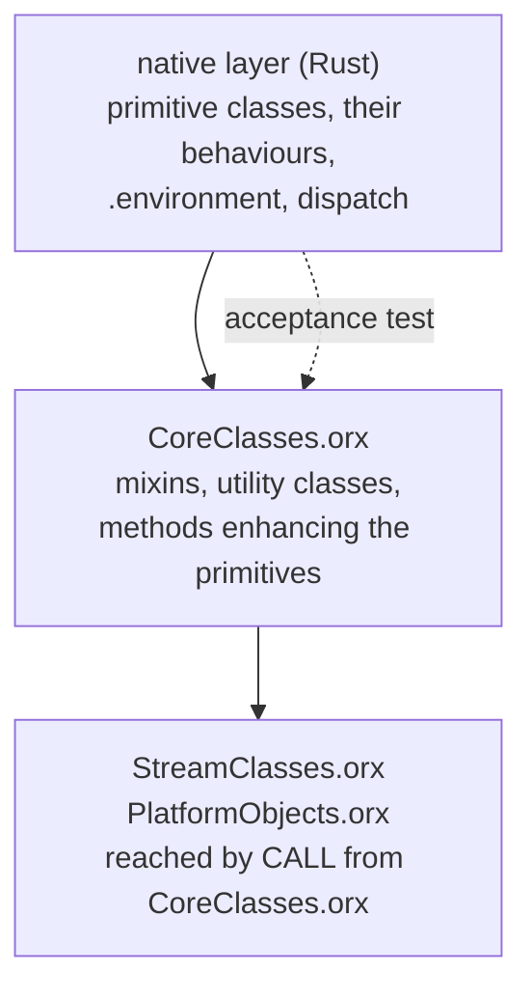

# Phase 5 -- the object model

**Status:** design. Not reviewed, not planned.
**Entry:** met. Phase 4f closed; `perf-baseline.md`'s "The pre-Phase-5 baseline" pins the standing at `b029abe77`.
**Blocks:** Phases 6, 7 and 8, which are independent of each other and may run in parallel once this closes.
**Decided:** 2026-08-15.

The evidence half of this spec is `2026-08-15-phase-5-inherited-surface.md`: every place the tree already
names Phase 5 as owner, read at the tree, plus the fourteen questions this document answers. Read it for
what is inherited; read this for what is decided. Where the two disagree, the survey is a dated reading of
`11638b91e` and this is the decision.

## The sentence the roadmap gets wrong, and what it changes

`2026-07-27-rust-rewrite.md:82` reads: *"a Rust core that can execute `CoreClasses.orx` inherits 32 classes
for free. Getting `CoreClasses.orx` to run is therefore the single highest-leverage milestone in the plan."*

**The leverage claim survives. The mechanism does not.** `CoreClasses.orx` does not bootstrap an object
model; it runs on top of one that already exists. `interpreter/memory/Setup.cpp`'s `createImage()` builds
the primitive classes in C++ first, and *only then*, at `Setup.cpp:1785`, resolves `BASEIMAGELOAD`
(`"CoreClasses.orx"`, `platform/unix/PlatformDefinitions.h:99`) and runs it as a program with
`TheRexxPackage` as its single argument.

The classes it builds, **in the order it builds them**, which is `createInstance()`'s call order in that
file and not an alphabetisation:

```
RexxClass RexxInteger RexxString RexxObject PointerClass BufferClass ArrayClass TableClass
IdentityTable RelationClass StringTable DirectoryClass SetClass BagClass ListClass QueueClass
NumberString MethodClass RoutineClass PackageClass RexxContext StemClass SupplierClass
MessageClass MutableBuffer WeakReference StackFrameClass RexxInfo VariableReference
EventSemaphoreClass MutexSemaphoreClass
```

`RexxClass` and `RexxInteger` come first because, as the file says, they "ha[ve] some special stuff";
`RexxString` and `RexxObject` next because they are "fairly critical". The rest of the order has no comment
on it and should not be assumed arbitrary.

What is in the file, read at it: its directives are `::METHOD`, `::CLASS` and `::ATTRIBUTE`, and nothing
else. Its `::CLASS` directives are mixins (`Collection`, `OrderedCollection`, `MapCollection`,
`SetCollection`, `Comparable`, `Comparator` and its six subclasses, `Orderable`, `SupplierMixin`,
`ManyItemMixin`, `SetMixin`, `BagMixin`, `MessageNotification`, `AlarmNotification`, `Singleton`) and
Rexx-level utility classes (`Alarm`, `Ticker`, `Monitor`, `CircularQueue`, `Properties`, `DateTime`,
`TimeSpan`, `ArgUtil`, `Validate`, `LocalServer`, `TraceObject`). Its file-scope `::METHOD` block --
`string_cls_nl`, `string_cls_alnum` and the rest -- exists to be attached to primitive classes that the
native layer has already created; the file's own comment calls them *"unattached METHOD definitions for
the various enhanced objects created above"*.

**Three consequences, and each of them shapes a decision below.**

* **`CoreClasses.orx` is a target, not a bootstrap.** It is the acceptance test for the native layer, not
  the source of it. This is why Q1's "native only, port the file to Rust" would have been a category
  error: the file's content is not the object model.
* **The loader is not on the critical path.** No `::REQUIRES`, no `::ROUTINE`, no `::OPTIONS` anywhere in
  it. Whatever `::REQUIRES` costs, it does not gate the bootstrap. See [D30](#decisions-recorded-here).
* **`call 'StreamClasses.orx' rexxPackage` and `call 'PlatformObjects.orx' rexxPackage` are how the other
  two files are reached** -- a `CALL` on a program name, from inside `CoreClasses.orx`, passing the package
  object along. Running the first file is running all three.

Verified in this session: our interpreter on `CoreClasses.orx` today exits 120 with
`rexx-exec: ::CLASS naming another class is not implemented (Phase 5)`.

## The three layers



**The line between the native layer and the sourced layer is discovered, not mirrored** (Q1, decided
2026-08-15). The native set is whatever running `CoreClasses.orx` turns out to require, grown one refusal
at a time, rather than a transcription of `Setup.cpp`'s `createInstance()` list.

**The hazard that choice carries, stated rather than argued away.** `createInstance()` does more than make
a class exist: it fixes metaclass links, superclass edges and the order the behaviours are built in, and
a wrong link there does not fail where it is made. It surfaces much later as `~class` answering the wrong
object, or a method resolving through the wrong dictionary. Running `CoreClasses.orx` is a strong instrument
for *which* classes are needed and a weak one for *how they are wired*. Two mitigations, both cheap, and
neither of them re-decides Q1:

* **The `Setup.cpp` list is a checklist, not a plan.** Every class that file creates and this phase does
  not is recorded in a table with the reason, so an absence is a decision with a name on it rather than a
  gap nobody noticed. `rexx-classes` carries that table as a test over its own registry.
* **Wiring is asserted against the oracle, not against the file.** `~class`, `~superClass`, `~isA` and
  `~metaClass` on every class in the native set, byte for byte against the oracle. Those four answers are
  the observable shadow of the wiring, and they are cheap to take.

### The native layer -- `rexx-classes`

New crate (Q3, decided 2026-08-15), as `2026-07-27-rust-rewrite.md:517` plans -- where it is marked
"Phase 4-5", and nothing in Phase 4 created it, so all of it is this phase's. It owns:

* the class objects for the primitive kinds, and the registry that finds them by name;
* the behaviour tables and the method dictionaries they flatten (see below);
* the metaclass graph, including `.class` being an instance of itself;
* `.environment` and `.local` as real directory objects.

**Stating the boundary before the code exists is the cost of this choice, so it is stated here and
reaching past it is a spec amendment, not a refactor.** `rexx-classes` depends on `rexx-core` (the heap,
`ObjRef`, `Body`) and on nothing in `rexx-exec`. `rexx-exec` depends on `rexx-classes`. The interface is
two operations and one table:

| `rexx-exec` asks `rexx-classes` for | shape |
|---|---|
| resolve | given a receiver's behaviour and an uppercased message name, which method body |
| define | given a class, a name and a method body, install it and cascade |
| the registry | given an environment symbol, which object |

A method *body* is `rexx-exec`'s: it is parsed Rexx, it runs on the executor, and `rexx-classes` holds only
its id. That is what keeps the dependency one-way. A native method -- `~string`, `~class`, the collection
primitives -- is a Rust function whose id resolves through the same table, which is exactly how
`CPPCode::resolveExportedMethod` works on the C++ side.

### The sourced layer -- `rexx-lib`

New crate, `2026-07-27-rust-rewrite.md:518`. It owns the three `.orx` files, how they are located, and the
bootstrap that runs them. It
embeds them rather than reading them from a search path: a bootstrap that depends on the filesystem is a
bootstrap that fails differently on a machine with a stale install, and the C++'s own reason for a search
path is `rexximage`, which [D26](#decisions-recorded-here) does not build.

The files are copied from the read-only oracle tree at build time by a build script, with their upstream
sha256 recorded, so that a drift is a build-time failure rather than a silent divergence. **They are never
edited.** A gap in our interpreter is fixed in our interpreter.

## Dispatch

**D24 already settled the shape and this phase does not revisit it**: dispatch is `resolve` and `invoke`,
two operations, not one fused `send`. The IR's `Send` op calls the pair; the tree-walker and `eval.rs` call
the same pair.

**Resolution is dynamic, with no per-call-site cache** (Q2, decided 2026-08-15). The `CallSite` slot in
`ir.rs` stays what it is -- a classic-call cache whose correctness rests on `Interp::routines` being
append-only -- and no send goes through it. Phase 4e's own D24 amendment says why this is the right
default and it is worth repeating, because the opposite reading is the natural one: the classic call-site
cache is correct **because it needs no guard**, which is precisely the property a send cache lacks. The
classic case validates the seam and not the caching discipline.

The measurement that would justify a send cache does not exist. `dispatch`, `alloc` and `heapshape` have no
Rust number at all -- all three exit 120 on a message send today, which the baseline's last table records.
A cache built now is built against a guess.

### The behaviour table is flattened, and that is semantics rather than caching

**This is the part most likely to be got wrong, because the existing type invites the wrong shape.**
`rexx-core`'s `BehaviourTable::lookup` walks a superclass chain at lookup time, following
`BehaviourEntry::superclass`. ooRexx does not resolve that way. `RexxClass::createInstanceBehaviour`
(`ClassClass.cpp:1148`) builds a **flat** method dictionary into the behaviour when the class is defined,
and `updateSubClasses` / `updateInstanceSubClasses` (`ClassClass.cpp:1036`, `:1071`) clear it, rebuild it,
and cascade the rebuild to every subclass, whenever anything upstream changes.

Two things follow, and neither is negotiable:

* **A chain walk gives different answers.** ooRexx has multiple inheritance through `MIXINCLASS` and
  `INHERIT`; `CoreClasses.orx` uses it directly (`::CLASS 'DateTime' public inherit Comparable Orderable`).
  The method a diamond resolves to is whatever `createInstanceBehaviour`'s merge order produces, and a
  linearised walk at lookup time is a different algorithm with different answers. `BehaviourTable` as it
  stands cannot express a mixin at all -- `superclass` is a single `Option<BehaviourId>`.
* **"Always dynamic" and "flattened" are not in tension.** The decision not to cache is about the *call
  site*. The flattened dictionary is not a cache of resolution; it *is* resolution, and its invalidation
  is not an optimisation problem but the `updateSubClasses` cascade, which the oracle already specifies.

So `rexx-classes` builds the dictionary at definition time, keyed by the uppercased name, and a send is one
hash lookup in the receiver's behaviour. The subclass list each class keeps, so that a cascade can find its
dependents, is part of the class object rather than a side table.

`BehaviourId` survives as an index into that table and is **not** the class's identity (Q5). A class is an
object -- `.class` is an instance of itself -- so its identity is an `ObjRef`. `BehaviourId` stays a
`u16` index for the primitive fast path and is derived from the class object, never the other way round.
The collector's root set stays enumerable because class objects live in the arena like everything else,
which is D1's own criterion.

## `.environment`, `.local` and the `VALUE` gap

`.environment` and `.local` become real directory objects in `rexx-classes`, and every consumer resolves
through them: `.NAME` environment-symbol lookup, the class registry, and `VALUE`'s local-pool read.

**That last one is currently silently wrong, which is worse than the refusals around it.**
`phase-4-exclusions.txt` records it as a KNOWN GAP with **no owner assigned**, on the ground that closing it
*is* building this subsystem. `VALUE`'s local-pool read of a leading-dot name falls back to the argument's
own upcased spelling when the name is undefined -- correct behaviour, and the oracle's own fallback -- but
this crate has neither the package-environment lookup nor the reflection-name table in front of it, so a
name either would have resolved comes back as its own spelling at rc 0. Measured there:
`say value('.LOCAL')` gives `The Local Directory` on the oracle and `.LOCAL` here; `say value('.ARRAY')`
gives `The Array class` and `.ARRAY`. The same name is *loud* on the ordinary expression path -- `say
.LOCAL` exits 120 -- so one route answers wrongly in silence while the other refuses. Both routes close
here, together, or the asymmetry survives.

**One table, not two.** The alternative -- a name table now, directory objects later -- buys a shorter first
task and costs a second mechanism to delete, and the deletion is the expensive half. `Setup.cpp` puts the
`LOCAL` method on `TheEnvironment` before `CoreClasses.orx` runs, so a directory object that answers `~`
is needed at bootstrap regardless.

## Directives

`::CLASS`, `::METHOD` and `::ATTRIBUTE` are this phase's, in that order, because that is the order
`CoreClasses.orx` needs them.

**`::OPTIONS` and the `OPTIONS` instruction leave this phase** (Q7). `::OPTIONS`'s measured effect is
`digits()`, `form()` and `fuzz()` -- package settings, with no connection to the object model -- and the
bare `OPTIONS` instruction runs silently at rc 0 on the oracle while this crate refuses it at 120, which
`phase-4-exclusions.txt` records as a known gap. Neither belongs to the object model and neither blocks it.
They are a package-settings unit that can land before, during or after this phase, and taking them out of
Phase 5 deletes two over-refusals without touching dispatch.

`::REQUIRES` stays in Phase 5 but lands **last**, after the bootstrap runs, for the reason
[D30](#decisions-recorded-here) records: it is the one thing that breaks the two append-only arguments the
`CallSite` table and the plan cache are built on, and there is no reason to spend that risk before the
phase's own acceptance test passes without it.

`REPLY` and `GUARD` get their **legality check only** (Q9). Re-measured this session: outside a method the
oracle answers at **translation** time and exits 157 --

```
     1 *-* reply
Error 99 running /abs/r.rex line 1:  Translation error.
Error 99.919:  REPLY can only be issued in an object method invocation.
```

with `GUARD` giving 99.911 in the same shape. This crate exits 120 on both with `REPLY is not implemented
(Phase 5)`. So the whole observable behaviour of both instructions *outside a method* is a translation-time
refusal that is already specified and already testable, and it is this phase's. The run-time half is
concurrency, which is Phase 6's, and a degenerate single-activity semantics built here is a thing Phase 6
would have to delete.

## Trace: `>M>` and `>N>`

The 4c gate hands this phase a hole and it is closed here rather than inherited again. `tests/support`
normalises the prefix offset and collapses the space run that carries nesting indent, so **an off-by-two
indent on a new trace line is invisible to every corpus instrument in the tree**.

Two instruments, because they fail differently (Q12):

* **In-crate exact-stderr assertions** for `>M>` and `>N>`, in the shape the three existing `run.rs` indent
  tests already use, one per nesting depth. These fail loudly and locally.
* **`ir_dual`**, which diffs raw stderr between the two engine arms and therefore sees indent, keeps both
  engines honest about it.

The survey records that `>N>` is produced by `ClassResolver` and not by `QualifiedCall`, and that
`ns:hfn()` traces `>F>`. That correction belongs in whatever gate document repeats the old claim.

## Value representation

`Body` is asserted at 80 bytes and its own comment says **"Phase 5 adds variants and is expected to trip
this"**. It trips deliberately or not at all: a new kind arrives boxed behind `Body::Instance` unless a
measurement is taken and recorded that says widening is worth it for that kind (Q4). The pinned baseline is
what such a measurement compares against, and `bench-baselines/README.md` states the floor to read an
`across_builds` movement against.

`ExprKind::List` becomes a real Array in this phase, from the first commit that makes `~` work (Q10). The
ast doc's own discriminator is why: `(1,)~size` is 2 and `(1,,)~size` is 3, which no string approximation
reproduces -- and which is unobservable until dispatch lands and observable immediately after. Shipping the
approximation would mean shipping a divergence that becomes visible in the same phase that creates it.

## The bar

**Performance work is suspended for this phase**, per the roadmap's 2026-08-14 decision, and the suspension
is conditional on two things. The first is done: the standing is pinned at `b029abe77` in `perf-baseline.md`,
with a staged binary and `bench-baselines/pre-phase-5-arms.tsv`. The second is this phase's obligation.

**The guard is the classic axes only** (Q13): `arith`, `compound`, `strings`, `varlookup`, `alloc4c` and
`rexxcps`. A regression there is a Phase 5 defect. `dispatch`, `alloc` and `heapshape` become runnable
during this phase and their first readings are **new measurements, not regressions** -- there is nothing to
regress from. Re-role them in `rexx-bench-suite`'s `AXES` table in the same commit that removes the refusal,
so the suite's blocked-axis assertion stays true rather than red.

**What a guard run is.** A two-build sitting, `--build pinned=bench-baselines/pinned/rexx-run-pre-phase-5
--build head=target/release/rexx-run`, interleaved, read against the floor rather than against zero. Run it
at each task that touches an execution path, not once at the end: attribution across a large refactor is
not available after the fact, which is the whole reason the baseline exists.

**`apply_binary` is not optimised in this phase and not measured before it.** It is 13.5% of the pinned
`rexxcps`' allocations, and Rexx objects can override the operator methods, so this phase must add an object
check to that path. Its shape is about to change; measuring it now measures the wrong function.

## The gate

**A `phase-5.txt` corpus subset, compared byte for byte against the oracle on stdout, stderr and exit
status, on both engines** (Q11, decided 2026-08-15). It extends the existing `corpus.rs` mechanism, which is
the instrument every prior phase closed on.

Exit criteria:

1. `CoreClasses.orx`, `StreamClasses.orx` and `PlatformObjects.orx` all run to completion, on both engines.
2. The `phase-5.txt` corpus subset passes byte for byte against the oracle, on both engines. It contains at
   minimum: an instance of each class the native layer creates, `~class` / `~superClass` / `~isA` /
   `~metaClass` on each, one program per mixin in `CoreClasses.orx`, and the four `directive_gap`
   over-refusals this phase retires.
3. `>M>` and `>N>` are pinned by in-crate exact-stderr assertions, one per nesting depth, and `ir_dual`
   agrees on raw stderr.
4. No classic axis regressed against the pinned baseline beyond the floor, with a two-build sitting per
   task that touched an execution path.
5. Every class `Setup.cpp` creates is either in the native layer or in the deferral table with a reason.
6. Cold start measured with hyperfine against `build/bin/rexx`, which is what D2 asks for. **This is a
   measurement, not a pass/fail** -- D2's gate is "build the image cache only if bootstrapping from source
   costs more than ~50 ms over the C++ startup", and answering that question is what closes D2.

**The L2 rung is reported, not gated.** The roadmap's phase table names it, and the roadmap also records at
`2026-07-27-rust-rewrite.md:304` that the ooTest framework cannot start without `SysFileExists` and `.File`,
which are Phase 7's. A gate criterion that cannot be reached is worse than no criterion.

**Criterion 2 is what makes criterion 1 mean something.** A bootstrap that runs to completion proves the
file did not raise; it does not prove a class responds. A registry of thirty-two empty class objects
satisfies criterion 1 and fails criterion 2 on its first `~`.

## Risks

| risk | consequence | response |
|---|---|---|
| `CoreClasses.orx` opens semantic gaps in bulk | the phase stalls on a long tail | expected, and the roadmap says so. Triage per gap; do not start Phases 6-8 until this closes |
| the discovered native set is wired wrong | `~class` answers wrong, much later | the four-answer oracle assertion above, taken per class, not at the end |
| `Body` widens quietly | every program pays for a cold kind | the `size_of` assertion trips; a widening needs a recorded measurement |
| the flattened dictionary is built as a chain walk | multiple inheritance resolves differently from the oracle | a mixin diamond in `phase-5.txt` from the first commit that defines a class |
| the crate boundary is in the wrong place | `rexx-exec` reaches past it | the interface table above; reaching past it is a spec amendment |
| a Phase 5 refactor costs 30% on a classic axis | nobody attributes it | the per-task two-build sitting, not one run at the end |

## Decisions recorded here

* **D25.** The native/sourced line is **discovered by running `CoreClasses.orx`**, not mirrored from
  `Setup.cpp`. `Setup.cpp`'s `createInstance()` list is a checklist: every class on it that this phase does
  not build is recorded with a reason, and the wiring of every class this phase does build is asserted
  against the oracle through `~class`, `~superClass`, `~isA` and `~metaClass`.
* **D26.** `CoreClasses.orx`, `StreamClasses.orx` and `PlatformObjects.orx` are **executed**, embedded at
  build time from the read-only oracle tree with their upstream sha256 recorded, and never edited. No image
  is built; D2's threshold is measured at this phase's exit with hyperfine, as D2 says.
* **D27.** The object model lives in **new crates**, `rexx-classes` and `rexx-lib`, with the one-way
  dependency and the three-operation interface stated above. `rexx-classes` holds method *ids*; bodies stay
  in `rexx-exec`.
* **D28.** Message resolution is **dynamic, with no per-call-site cache**. `ir.rs`'s `CallSite` is not
  extended to sends. Revisit only against a `dispatch` axis number, which does not exist yet.
* **D29.** The method dictionary is **flattened at class-definition time** and rebuilt through a cascade to
  subclasses, as `createInstanceBehaviour` and `updateSubClasses` do. `BehaviourTable`'s chain walk is
  replaced, not extended. A class's identity is an `ObjRef`; `BehaviourId` survives as an index for the
  primitive fast path and is derived from the class object.
* **D30.** `::REQUIRES` lands **last in this phase**, after the bootstrap passes without it. It is the one
  construct that breaks the append-only arguments the `CallSite` table and the plan cache rest on, and
  `CoreClasses.orx` does not use it.
* **D31.** `::OPTIONS` and the `OPTIONS` instruction **leave this phase** as a package-settings unit. They
  are unrelated to the object model and their removal deletes two over-refusals early.
* **D32.** `REPLY` and `GUARD` get their **translation-time legality check only**. The run-time half is
  Phase 6's.
* **D33.** `.environment` and `.local` are **real directory objects** from the first task, and the class
  registry, environment-symbol lookup and `VALUE`'s empty-selector form all resolve through them.
* **D34.** `ExprKind::List` is a **real Array** from the first commit that makes `~` work. No string
  approximation ships.
* **D35.** The performance guard is the **classic axes only**, run as a two-build sitting per task that
  touches an execution path. `dispatch`, `alloc` and `heapshape` are new measurements and are re-roled in
  the same commit that removes their refusal.
* **D36.** The gate is a **`phase-5.txt` corpus subset** against the oracle on both engines, plus in-crate
  exact-stderr assertions for `>M>` and `>N>`. The L2 rung is reported, not gated, because it cannot start
  without Phase 7's `Sys*`.

## Open questions for the plan

* **Whether the build order above is load-bearing.** D25 says the *set* is discovered; the order is quoted
  above from `createInstance()`'s call sequence, but only four of its positions carry a stated reason. A
  bootstrap order is cheap to copy and expensive to rediscover, so the plan should copy it -- and should
  say whether it *has* to, which nothing here establishes.
* **What plays the oracle for a native method.** A collection primitive implemented in Rust has an oracle --
  the C++ method -- reachable through a Rexx program. A method that `CoreClasses.orx` defines has an oracle
  by construction. There is no third case in this phase, but the plan should say so rather than leave it
  implied.
* **Whether `PlatformObjects.orx` is in scope.** `CoreClasses.orx` calls it. It is `interpreter/platform/unix/`,
  it is small, and nothing has read it yet.
* **`::ANNOTATE`.** It is one of the four `directive_gap` over-refusals and the survey classes it as an
  object-model refusal. Nothing here has measured what it does.
* **The security manager's interception shape (D12, Q14).** D12 splits it across Phases 5 and 7 and requires
  the *design* be fixed here so Phase 7 adds call sites rather than inventing a second mechanism. This spec
  does not fix it, and the plan must, before the first dispatch call site is written.
* **`::CLASS naming another class`, the refusal we hit first.** It is the phase's first task by
  construction, and the plan should confirm that its removal is what makes `CoreClasses.orx` reach its
  second refusal rather than its first.
