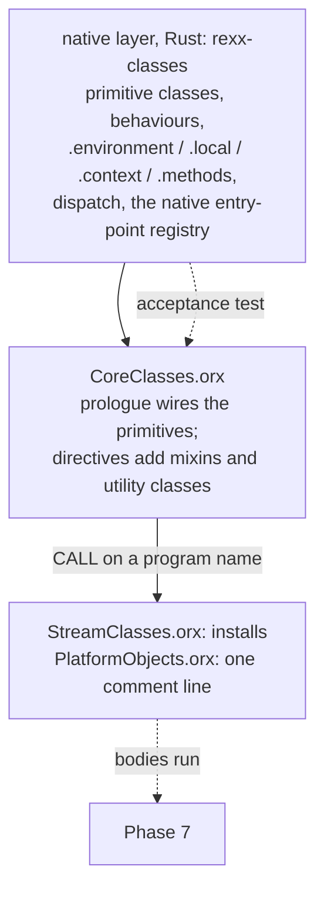

# Phase 5 -- the object model

**SUPERSEDED 2026-08-17 by `docs/superpowers/specs/2026-08-17-phase-5-object-model.md`, which is the
binding authority. Do not plan against this file.**

It was written without the ooRexx documentation, which nobody had checked out until 2026-08-17; the
documentation lives in the same SVN repository as `ootest/` and is now at `oodocs/`. Two of
`provide.xml`'s thirteen object-model sections -- `UNKNOWN` and Required String Values -- are absent
from this file entirely, and both are silent wrong answers at rc 0 in surface Phase 5a had already
made reachable. A five-reviewer panel, a two-reviewer re-review and three rounds of plan review all
failed to find them; reading the documentation found them.

Kept for its record of how this phase is easy to get wrong, and because the replacement's D25-D45
disposition table cites it row by row.

**Status:** design, revised twice -- after a five-reviewer adversarial panel, then after a two-reviewer
re-review of that revision. Not planned.
**Entry:** met. Phase 4f closed; `perf-baseline.md`'s "The pre-Phase-5 baseline" pins the standing at `b029abe77`.
**Blocks:** Phases 6, 7 and 8, which are independent of each other and may run in parallel once this closes.
**Decided:** 2026-08-15. Revised 2026-08-15 after review.

The evidence half of this spec is `2026-08-15-phase-5-inherited-surface.md`: every place the tree already
names Phase 5 as owner, read at the tree, plus the fourteen questions this document answers. Read it for
what is inherited; read this for what is decided. Where the two disagree, the survey is a dated reading of
`11638b91e` and this is the decision. **One of the survey's own claims is withdrawn here** -- see
[the bootstrap's reach](#what-the-bootstrap-actually-reaches).

**What review changed, and it was the shape of the phase rather than its details.** The first draft's
headline criterion -- the three `.orx` files run to completion -- is not reachable by a phase scoped to the
object model, because two of the three bind natives belonging to Phases 6 and 7, *eagerly, at
directive-install time*. The second draft's replacement was worse: it demanded a transcript
byte-identical to an oracle that **cannot run the prologue at all**. The first draft also proposed a
wiring check that could not fail, and claimed a byte-for-byte corpus comparison the harness does not
perform. And neither draft designed **the object** -- instance variables are scoped by defining class,
which the representation already committed in `rexx-core` cannot express.

Every correction below is called out where it sits, with what was measured. The withdrawn sentences are
left visible rather than quietly replaced: this document's errors are the most useful record it has of
where the phase is easy to get wrong.

## The sentence the roadmap gets wrong, and what it changes

`2026-07-27-rust-rewrite.md:82` reads: *"a Rust core that can execute `CoreClasses.orx` inherits 32 classes
for free. Getting `CoreClasses.orx` to run is therefore the single highest-leverage milestone in the plan
(Phase 5), and everything before it is scaffolding for that moment."*

**The leverage claim survives. The mechanism does not.** `CoreClasses.orx` does not bootstrap an object
model; it runs on top of one that already exists. `interpreter/memory/Setup.cpp`'s `createImage()` builds
the primitive classes in C++ first, and *only then*, at `Setup.cpp:1785`, resolves `BASEIMAGELOAD`
(`"CoreClasses.orx"`, `platform/unix/PlatformDefinitions.h:99`) and runs it as a program with
`TheRexxPackage` as its single argument.

`createImage()` is the **image-build** path, run by `rexximage` at C++ build time, not the startup path.
For the native/sourced question that is no weakness -- it is exactly where the C++ decides what is native
and what is sourced, and the ordering it fixes is the ordering the restored image reproduces. **It is a
severe weakness for anything wanting a transcript**, and the second draft's version of this sentence,
"that does not weaken the point", is what let an unsatisfiable criterion 1 through. See
[the bootstrap has no oracle transcript](#the-bootstrap-has-no-oracle-transcript-and-two-of-its-methods-do-not-exist-in-the-shipped-image).

The classes it builds, **in the order it builds them**, which is `createInstance()`'s call order in that
file and not an alphabetisation:

```
RexxClass RexxInteger RexxString RexxObject PointerClass BufferClass ArrayClass TableClass
IdentityTable RelationClass StringTable DirectoryClass SetClass BagClass ListClass QueueClass
NumberString MethodClass RoutineClass PackageClass RexxContext StemClass SupplierClass
MessageClass MutableBuffer WeakReference StackFrameClass RexxInfo VariableReference
EventSemaphoreClass MutexSemaphoreClass
```

`RexxClass` and `RexxInteger` come first because, as the file says, they "ha[ve] some special stuff";
`RexxString` and `RexxObject` next because they are "fairly critical". `PointerClass` carries an explicit
causal reason too -- "needs to be created early because other classes use the instances to store
information" -- and `BufferClass` a weaker one. The remaining comments in `createImage()` are groupings
rather than reasons, and the order should not be assumed arbitrary on that account.

What is in `CoreClasses.orx`, read at it: its directives are `::METHOD`, `::CLASS` and `::ATTRIBUTE`, and
nothing else. Its `::CLASS` directives define classes that are **not** primitives -- some declared
`MIXINCLASS` (`Collection`, `OrderedCollection`, `MapCollection`, `SetCollection`, `Comparable`,
`Comparator` and its seven subclasses, `Orderable`, `MessageNotification`, `AlarmNotification`,
`Singleton`), some plain classes that exist only to donate methods (`SupplierMixin`, `ManyItemMixin`,
`SetMixin`, `BagMixin` -- named "mixin" by the file but **not** declared `MIXINCLASS`, which matters
because the prologue installs them with `~inheritInstanceMethods` rather than `~inherit`), and some
ordinary Rexx-level classes (`Alarm`, `Ticker`, `Monitor`, `CircularQueue`, `Properties`, `DateTime`,
`TimeSpan`, `ArgUtil`, `Validate`, `LocalServer`, `TraceObject`). Its file-scope `::METHOD` block --
`string_cls_nl`, `string_cls_alnum` and the rest -- exists to be attached to primitive classes that the
native layer has already created; the file's own comment calls them *"unattached METHOD definitions for
the various enhanced objects created above"*.

So **`CoreClasses.orx` is a target, not a bootstrap.** It is the acceptance test for the native layer, not
the source of it. Q1's option (b), a hand port of the file, was rejected on the trade rather than on
principle: its prologue *is* model construction, so porting it is buildable and costs 4,193 lines with no
oracle for any of them.

## What the bootstrap actually reaches

**The first draft treated `CoreClasses.orx` as opaque and proposed discovering its requirements by running
it. Most of them are readable today, and this section reads them.** That does not overturn the decision to
grow the native set by running the file; it bounds it, which is what makes it a task rather than a loop.

### The prologue is the object-model workout

`CoreClasses.orx`'s executable top level runs from `use arg rexxPackage` to `exit`, ahead of the first
directive. Every clause in it is object-model machinery, and this is the single densest statement of what
the phase must build:

| the prologue does | what that requires |
|---|---|
| `use arg rexxPackage` | a live **Package object** passed as the program's argument |
| `rexxPackage~addClass`, `~addPublicClass`, `~objectname=` | three Package methods, one of them an attribute assignment |
| `.environment~objectname = "The Environment Directory"` | `.environment` as a real object accepting a message |
| `publicClasses = .context~package~publicClasses` | **`.context`**, the per-activation `RexxContext` reflection object, live during the bootstrap |
| `do name over publicClasses` | `DO OVER` a **collection object**, not an array |
| `publicClasses[name]` | the `[]` index message |
| `.environment~put(class, name)` | Directory `~put` |
| `do name over "nl", "cr", ...` | `DO OVER` a comma-separated **expression list**, over a line continuation -- a different construct from the row above |
| `.methods[("string_cls_" \|\| name)~upper]` | **`.methods`**, the package's unattached-method directory |
| `.String~defineClassMethod(name~upper, ...)` | a class-side method that mutates behaviour after definition. **Image-build only** -- see below |
| `.supplier~inheritInstanceMethods(.SupplierMixin)` and four more | method donation without a superclass edge. **Image-build only** -- see below |
| `.string~inherit(.Comparable)` and the rest | real mixin edges, and the `updateSubClasses` cascade |
| `.LocalServer`, `.SupplierMixin` and three more at `:47`-`:52` | environment symbols naming classes declared **later in the same file with no `PUBLIC`**, so `.NAME` must consult the running package's own class table before `.environment` |
| `call 'StreamClasses.orx' rexxPackage` and the same for `PlatformObjects.orx` | a `CALL` on a **program name** |

Two of those are **environment symbols** rather than registry entries, and neither is satisfied by the
class registry: `.context` and `.methods`. (`RexxContext` the *class* is in `Setup.cpp`'s list; `.context`
the symbol is a live per-activation object, and `.methods` is a package's own directory.) Both exit 120
today with `an environment symbol is not implemented`, against oracle rc 0 answering `a RexxContext` and
`.METHODS`. The
prologue is therefore not satisfied by the class registry alone, and D33's directory work is a hard
prerequisite for it rather than a parallel track.

### The `EXTERNAL` wall, and why criterion 1 had to change

**`::METHOD ... EXTERNAL 'LIBRARY REXX name'` binds eagerly, when the directive is installed, and the
program's prologue never runs if a bind fails.** Measured this session against the oracle: a file whose
prologue is `say "prolog ran"` and which carries one `::METHOD zz EXTERNAL 'LIBRARY REXX nosuchentry'`
exits **166** with **empty stdout** and `Error 90.998: Unable to find external method "nosuchentry"`. The
same file naming a real entry point (`alarm_startTimer`) exits 0 and prints.

`::CONSTANT` with a parenthesised expression evaluates at install time too, and its two failure modes are
different directives' business. Measured, on files whose prologue is `say "prolog ran"`:

```
::CONSTANT sep (.NoSuchClass~getThing)            rc 157, stdout empty
                                                  99.906, "requires a matching ::CLASS directive"
::CLASS K then ::CONSTANT sep (.NoSuchClass~m)    rc 159, stdout empty, 97.1 on the expression
```

The first is structural and the expression is never reached; **the second is the one that shows the
evaluation**, and it is the shape `StreamClasses.orx` uses.

Against that, what the three files carry:

* **`CoreClasses.orx`** has `::METHOD ... EXTERNAL` at `:1590`, `:1618`, `:1690`, `:1691`, `:1692` --
  `alarm_startTimer`, `alarm_stopTimer`, `ticker_createTimer`, `ticker_waitTimer`, `ticker_stopTimer`.
  Timers. Phase 6's subject. They are **bound** during bootstrap and **not called** by it.
* **`StreamClasses.orx`** carries a large family of `EXTERNAL` declarations naming stream and file
  natives, plus `::CONSTANT separator (.File~getSeparator)` and `::CONSTANT pathSeparator
  (.File~getPathSeparator)` at `:548`-`:549`, whose targets are declared at `:546`-`:547` as
  `external "LIBRARY REXX file_separator"` and `"LIBRARY REXX file_path_separator"`. Those two are
  **called** at install time, not merely bound.
* **`PlatformObjects.orx`** on unix is one line: `-- Nothing to do currently`.

`::METHOD EXTERNAL` is already a declared **Phase 7** refusal in this crate
(`rexx-exec/src/lib.rs`, `directive_gap`'s `::METHOD EXTERNAL` arm). And the roadmap's **Phase 7** row, not
Phase 5's, is the one that says *"`StreamClasses.orx` runs"*; the Phase 5 row names `CoreClasses.orx` and
nothing else. The crate-layout line at `:518` says `rexx-lib/ # Phase 5: loads CoreClasses.orx /
StreamClasses.orx` -- **loads**, which the first draft converted to *runs to completion*. The survey made
the same slip, quoting the one-asset gate row and then writing "the three assets that gate names"; that
sentence of the survey is withdrawn.

**The resolution, and it is [D37](#decisions-recorded-here).** Phase 5 builds a **native entry-point
registry**: every `LIBRARY REXX` name the three files declare is *registered*, so eager binding resolves
exactly as it does on the oracle. A registered entry Phase 5 does not implement raises this crate's
not-implemented condition **when invoked**, naming its owning phase. That confines the divergence to
invocation, which is where the later phase lands, and keeps install-time behaviour identical.

Two entry points are pulled into Phase 5 as an explicit, stated scope addition, because `CoreClasses.orx`
cannot reach its own `exit` without them: `file_separator` and `file_path_separator`. They return platform
constants and nothing about them is a stream. Everything else in `StreamClasses.orx` stays Phase 7's.

### The bootstrap has no oracle transcript, and two of its methods do not exist in the shipped image

**`RexxClass::removeSetupMethods()` (`ClassClass.cpp:923`) deletes `DEFINECLASSMETHOD` and
`INHERITINSTANCEMETHODS` from the image**, and `Setup.cpp:1809` calls it *after* `CoreClasses.orx` has run
at `:1798` and *before* `saveImage`. Its own doc comment is "Remove the special class methods that are
defined just for image building". Measured against the shipped oracle:

```
say .String~hasMethod("DEFINECLASSMETHOD")        0
say .Supplier~hasMethod("INHERITINSTANCEMETHODS") 0
say .Class~hasMethod("DEFINE")                    1
.String~defineClassMethod("ZZ", ...)              rc 159, 97.1 "does not understand"
```

So the prologue's `~defineClassMethod` and `~inheritInstanceMethods` clauses can only run inside
`rexximage`'s `createImage()`, in a process where those methods still exist. **There is no invocation of
the shipped oracle in which `CoreClasses.orx`'s prologue reaches `exit`**: with no argument it dies at its
first clause, and with a real Package object supplied it dies at the `~defineClassMethod` loop. Every
reachable transcript is a traceback at rc 159.

That kills "byte-identical to the oracle" for criterion 1, and the first draft's replacement asserted it
anyway. It does not kill the phase, because **the bootstrap's oracle is its result, not its transcript**.
The shipped interpreter answers `.Array~superClasses`, `.String~nl`, `.DateTime~new(...)` and everything
else the bootstrap produces. That is criterion 2's subject and it is a stronger test than a transcript
would have been: it checks what the bootstrap achieved rather than how it narrated itself.

[D39](#decisions-recorded-here) settles the shape: `rexx-classes` provides the two setup methods during
the bootstrap and **removes them afterwards**, reproducing `removeSetupMethods()`. Keeping them would be a
divergence any corpus program can see the moment it sends `~defineClassMethod`.

## The three layers



**The line between the native layer and the sourced layer is discovered by running `CoreClasses.orx`**
(Q1, decided 2026-08-15 by the human partner), rather than transcribed from `Setup.cpp`.

**The discovery is bounded by the prologue table above, and that is what makes it a task list rather than
an open loop.** The first draft said "grown one refusal at a time" and left the growth unbounded. It is
worse than unbounded as stated: the refusal instrument changes character partway through. `directive_gap`
refuses at install and enumerates *forms*, so it is a finite, readable list; once `::CLASS`, `::METHOD` and
`::ATTRIBUTE` land, the file installs silently and every later failure arrives one clause at a time from
the prologue. So:

* the **install-time** obligations are enumerable today and are enumerated above;
* the **prologue** obligations are enumerable today and are enumerated above;
* what genuinely remains discoverable-only is the behaviour of the method bodies, and those are not needed
  for criterion 1 -- they are needed for criterion 2, which is a corpus subset the plan writes.

**The hazard the discovery choice carries, stated rather than argued away.** `createInstance()` does more
than make a class exist: it fixes metaclass links, superclass edges and the order the behaviours are built
in, and a wrong link there does not fail where it is made. Two mitigations, and the first draft's version
of the first one **did not work**:

* **The wiring assertion must include `~superClasses`.** The first draft proposed `~class`, `~superClass`,
  `~isA` and `~metaClass`. Measured on the oracle: `.DateTime~superClass~id` is `Object` and
  `.Array~superClass~id` is `Object`, so **every mixin edge is invisible to that set** -- including the
  `inherit Comparable Orderable` this document cites two sections above, and the `.array~inherit(
  .OrderedCollection)` the prologue installs. `.DateTime~superClasses~makestring("LINE", ",")` answers
  `The Object class,The Comparable class,The Orderable class` and is the answer that sees them. A build
  that wired no mixin at all passed the first draft's check. This is the project's own recurring failure
  mode -- a check that runs, exits 0, and cannot see its subject -- shipped inside the mitigation for it.
* **The `Setup.cpp` list is a checklist, not a plan.** Every class that file creates and this phase does
  not is recorded in a table with a reason, and `rexx-classes` carries that table as a test over its own
  registry. A reason is a sentence naming what would have to exist; "not needed yet" is not one.

### The native layer -- `rexx-classes`

New crate (Q3, decided 2026-08-15 by the human partner), as `2026-07-27-rust-rewrite.md:517` plans -- where
it is marked "Phase 4-5", and nothing in Phase 4 created it, so all of it is this phase's. It owns the
class objects for the primitive kinds and the registry that finds them; the behaviour tables and the method
dictionaries they flatten; the metaclass graph, including `.class` being an instance of itself;
`.environment`, `.local`, `.context` and `.methods`; and the native entry-point registry.

**The one-way dependency the first draft asserted does not hold, and pretending otherwise would put the
boundary in the wrong place.** `.SomeClass~new` runs that class's `init`, which is a Rexx method body, which
runs on the executor. So class-side behaviour reaches execution. The boundary that *does* hold is
**dependency inversion at a trait**, not a one-way crate edge:

| `rexx-classes` owns | `rexx-exec` owns |
|---|---|
| the class graph, behaviours, flattened dictionaries, the registry | method **bodies**, and running them |
| `resolve(receiver_behaviour, name, start_scope, per_object) -> MethodId` | the `MethodId -> body` table and the invoke path |
| `define(class, name, MethodId)` and the `updateSubClasses` cascade | argument evaluation, the activation stack, conditions |
| the entry-point registry | the trait implementation `rexx-classes` calls to run a body |

`rexx-classes` depends on `rexx-core` and declares a trait for "run this method id against this receiver".
`rexx-exec` implements it. Neither names the other's concrete types. **Reaching past this is a spec
amendment, not a refactor** -- and the amendment bar is why the first draft's three-row prose table is
replaced by signatures above.

**`resolve` takes a start scope and a per-object table, and the first draft's version could not express
`FORWARD CLASS(SUPER)`.** The ordinary send is `behaviour->methodLookup(msgname)` --
`interpreter/classes/ObjectClass.cpp:866`, one hash lookup, as the first draft said. The scope-override
send is `superMethod(msgname, startscope)` at `:919`, reaching `RexxBehaviour::superMethod`
(`interpreter/behaviour/RexxBehaviour.cpp:584`) and `MethodDictionary::findSuperMethod`; `MethodDictionary`
carries a `scopeList` and `scopeOrders` alongside the name map, plus an `instanceMethods` table for
per-object methods. `CoreClasses.orx` uses `forward class(super)` throughout. So the flattened dictionary
must **retain scope ordering**, not merely merge names.

### The sourced layer -- `rexx-lib`

New crate, `2026-07-27-rust-rewrite.md:518`. It owns the three `.orx` files and the bootstrap that runs
them. The files are **tracked in this repository** -- they sit under `interpreter/RexxClasses/` and
`interpreter/platform/unix/`, which this worktree contains -- so a build script reaches them by a path
relative to the workspace, the way `crates/rexx-inventory/build.rs` already reaches the C++ tree. Nothing
depends on an absolute path or on a second checkout, and CI's five platforms are unaffected. **They are
never edited.** A gap in our interpreter is fixed in our interpreter.

`rexx-lib` also owns the **program-name resolution for the two `CALL`s in the prologue**. `call
'StreamClasses.orx'` would otherwise go to the external file search, which `Loud::unresolved_call`'s own
doc assigns to Phase 7. `rexx-lib` intercepts the three bootstrap names ahead of that search and never
touches the search itself; anything else stays Phase 7's.

## Dispatch

**D24 settled the shape, and D28 below amends half of it.** D24's words are: *"Dispatch is implemented once
as `resolve` and `invoke`, not one fused `send`. **The IR's `Send` op caches the resolution** and calls the
invocation; the tree-walker and `eval.rs` call the same pair **uncached**."* The first draft quoted that
sentence with the caching clauses removed and then said the phase does not revisit D24, which hid an
amendment behind a misquote. The `resolve`/`invoke` split stands unchanged. The caching clause does not.

**Resolution is dynamic, with no per-call-site cache** (Q2, decided 2026-08-15 by the human partner).
`ir.rs`'s `CallSite` slot stays a classic-call cache and no send goes through it. Phase 4e's own later
amendment (`2026-08-09-phase-4e-ir.md:1082`) is the reason and it is worth repeating because the opposite
reading is the natural one: the classic call-site cache is correct **because it needs no guard**, which is
precisely the property a send cache lacks. The classic case validates the seam and not the caching
discipline. And the measurement that would justify a send cache does not exist -- `dispatch`, `alloc` and
`heapshape` have no Rust number at all.

D24's forward constraints for Phase 5 (`2026-08-09-phase-4e-ir.md:1141`) are five: selectors interned at
compile time, a `SmallInt` behaviour arm, a receiver in the calling convention, a wider patch entry, and
invalidation on behaviour mutation. D28 disposes of the last two by declining the cache. **The first three
are this phase's and the plan owes a task for each**; this spec does not decide their shape.

### The behaviour table is flattened, and that is semantics rather than caching

**This is the part most likely to be got wrong, because the existing type invites the wrong shape.**
`rexx-core`'s `BehaviourTable::lookup` walks a superclass chain at lookup time, following
`BehaviourEntry::superclass`. ooRexx does not resolve that way. `RexxClass::createInstanceBehaviour`
(`ClassClass.cpp:1148`) builds a **flat** method dictionary into the behaviour when the class is defined,
and `updateSubClasses` / `updateInstanceSubClasses` (`ClassClass.cpp:1036`, `:1071`) clear it, rebuild it,
and cascade the rebuild to every subclass, whenever anything upstream changes.

Two things follow, and neither is negotiable:

* **A chain walk gives different answers.** ooRexx has multiple inheritance through `MIXINCLASS` and
  `INHERIT`; `CoreClasses.orx` uses it directly (`::CLASS 'DateTime' public inherit Comparable Orderable`)
  and its prologue installs a further set of `~inherit` edges onto the primitives -- `.string` onto
  `Comparable`, the ordered collections onto `OrderedCollection`, eight map collections onto
  `MapCollection`, `.set` and `.bag` onto `SetCollection`, and `.message` onto both notification mixins.
  The method a diamond resolves to is whatever `createInstanceBehaviour`'s merge order produces.
  `BehaviourTable` as it stands cannot express a mixin at all -- `superclass` is a single
  `Option<BehaviourId>`.
* **"Always dynamic" and "flattened" are not in tension.** The decision not to cache is about the *call
  site*. The flattened dictionary is not a cache of resolution; it *is* resolution, and its invalidation is
  not an optimisation problem but the `updateSubClasses` cascade, which the oracle already specifies.

`BehaviourId` survives as an index into that table and is **not** the class's identity (Q5). A class is an
object -- `.class` is an instance of itself, confirmed on the oracle: `.class~class == .class` answers `1`
-- so its identity is an `ObjRef`. `BehaviourId` stays a `u16` index for the primitive fast path, derived
from the class object and never the other way round. The collector's root set stays enumerable because
class objects live in the arena like everything else, which is D1's own criterion.

## `.environment`, `.local`, `.context`, `.methods`

All four become real objects in `rexx-classes` from the first task, because the bootstrap prologue needs
all four before any method body runs. Every consumer resolves through them: `.NAME` environment-symbol
lookup, the class registry, and `VALUE`.

**The `VALUE` gap is the one-argument form, and the first draft's decision named a different one.**
`phase-4-exclusions.txt` keeps two separate KNOWN GAP rows and they are not interchangeable. Measured this
session, both interpreters:

```
say value('.LOCAL')       oracle rc 0 "The Local Directory"    this crate rc 0 ".LOCAL"
say value('.ARRAY')       oracle rc 0 "The Array class"        this crate rc 0 ".ARRAY"
say value('.LOCAL',,'')   oracle rc 0 "..LOCAL"                this crate rc 120, external-selector refusal
say .LOCAL                                                     this crate rc 120
```

The **one-argument** form -- `value(name)`, no new value and no selector -- is the silently-wrong one and
is what this phase closes: a
leading-dot name, correct fallback to the upcased spelling when undefined, but no package-environment
lookup or reflection-name table in front of it. The **empty-selector** three-argument form is a loud
refusal whose oracle answer is `..LOCAL`, and closing it does not touch the silent path at all;
`phase-4-exclusions.txt`'s external-selector row records that only one of its three branches is Phase 5's.
Both the silent `value` route and the loud `say .LOCAL` route close here, together, or the asymmetry
survives.

## Directives

`::CLASS`, `::METHOD` and `::ATTRIBUTE` are this phase's.

**`::CONSTANT` is this phase's too, and it carries a divergence nothing had recorded.** The directive
parses today and a simple form runs; the **parenthesised expression form is accepted and never
evaluated**. Measured this session on a file whose prologue is `say "prolog"`:

```
::CONSTANT c (.NoSuchClass~m)     oracle rc 159, stdout empty     this crate rc 0, stdout "prolog"
```

The oracle evaluates the expression when the directive installs and the program never starts; this crate
parses it, stores nothing, and runs the prologue. `StreamClasses.orx:548` is exactly this form, calling a
native, so criterion 1 depends on closing it. **New KNOWN GAP** -- the plan's first task records it in
`phase-4-exclusions.txt` before fixing it.

**`::OPTIONS` and the `OPTIONS` instruction stay in this phase**, sequenced independently of dispatch
([D31](#decisions-recorded-here)). The first draft moved them out on the ground that package settings are
not the object model. That is true and it is not sufficient: a phase is a unit of work, not a taxonomy, and
moving them out created an owner nobody could spell while contradicting criterion 2, which asks for a
witness per `directive_gap` Phase 5 arm. They are cheap, they delete two over-refusals, and they gate
nothing -- so they land whenever the plan finds room.

**One supporting sentence from the first draft is withdrawn as false**: `::OPTIONS`'s effect is not
`digits()`, `form()` and `fuzz()`. `LanguageParser::optionsDirective`
(`interpreter/parser/DirectiveParser.cpp:948` onward) accepts `DIGITS`, `FORM`, `FUZZ`, `TRACE`, `NOVALUE`,
`ERROR`, `FAILURE`, `LOSTDIGITS`, `NOSTRING`, `NOTREADY`, `ALL`, `NOPROLOG`, `PROLOG` and `NUMERIC`, so it
reaches the condition regime and program prolog handling; `phase-4-exclusions.txt` describes it as changing
package settings unconditionally with `digits` as its worked example, and the first draft turned that one
example into an enumeration of the whole.

`::REQUIRES` stays in Phase 5 and lands **last**, after the bootstrap passes without it.
**Both of the first draft's reasons were wrong and both are withdrawn.** `ir.rs`'s `CallSite` doc says
append-only is what the 99.903 duplicate-`::ROUTINE` refusal enforces and that *"append-only is enough"*;
the property `::REQUIRES` would break is the stronger *"the map is written once"*, which that comment
explicitly says is **not** the reason. The same comment names an external-file call **beside**
`::REQUIRES` -- and `CoreClasses.orx:122` and `:124` are external-file calls, so criterion 1 meets that
construct whatever `::REQUIRES` does. What makes it harmless there: **neither `.orx` file declares a
`::ROUTINE`**, so the bootstrap's own external calls install nothing into that table. The plan cache is
untouched either way; `ProgramId`s are never reused because `Interp::programs` holds an `Rc` for every id
it issued, which is what loading more programs is built to survive.

The reason `::REQUIRES` lands last is plainer: **the bootstrap does not use it**, and it is the construct
most likely to force a change to the resolution model, which should be settled by the time it arrives.

`::ANNOTATE naming a target` is the fourth `directive_gap` Phase 5 arm, and it **is** measured -- twice,
in `directive_gap`'s own arm comment and in `phase-4-exclusions.txt`'s "REFUSED BY THE ORACLE" list:
`::annotate routine nosuchrtn` is 99.945 at rc 157. **The oracle refuses it too**, so it is not an
over-refusal and retiring it closes no divergence; what this phase owes is matching the oracle's refusal
bytes, not removing ours.

**`REPLY` and `GUARD` are checked at RUN time, not translation time, and the first draft got this wrong
from its own probe.** The error text says `Translation error` and the first draft read that as the
mechanism. Measured this session on the oracle:

```
if 1=0 then reply          rc 0, prints "reached"
if 1=0 then guard on       rc 0, prints "reached"
say "before" ; reply       rc 157, stdout "before", then Error 99.919
```

`reportException` sits inside `RexxInstructionReply::execute`. So a translation-time refusal would
**over-refuse programs the oracle runs**, and D32 is restated: Phase 5 implements the run-time legality
check, reached only when the instruction executes, exiting 157 with the oracle's bytes.

`GUARD` has a second, genuinely syntactic check that this crate half-built already and that diverges
today: bare `guard` with no `ON`/`OFF` is oracle rc **231** with a three-line transcript ending
`Error 25.913: GUARD must be followed by the keyword ON or OFF; found ";"`, against our rc 120 and a
one-line `rexx-exec: 25.913: Invalid subkeyword found.` Two checks, two shapes, and only one of them is
about methods. The concurrency
behaviour of a `REPLY` that *is* inside a method is Phase 6's, and the plan must say what a Phase 5 method
containing a `REPLY` does -- this spec does not, and that is an open question below rather than a silent
gap.

## The constructs, and the committed tables that have to move with them

**`owners.rs`'s `EXPECTED_OUT_OF_SCOPE` is the committed list of what this phase owns at the AST**, and
the sections above name only some of it. The rest, stated here so no task discovers it late:
`InstructionKind::Expose`, `Forward`, `Message`, `Call::Qualified`, `Guard`, `Reply`, `Options`;
`ExprKind::QualifiedCall`, `ClassResolver`, `List`, `Message`; `LoopKind::With`.

**`EXPOSE` and `FORWARD` are not edge cases and neither is designed above.** `CoreClasses.orx` has 112
clause-initial `expose` and 30 `forward`; `StreamClasses.orx` has 15 and 7. `EXPOSE` is how a method
reaches its scope's variable dictionary, so it is inseparable from the object section's scoped instance
variables. `FORWARD CLASS(SUPER)` is what forces `resolve`'s start-scope argument.

**Phase 5 cannot land without editing several committed tables, each of which fails when a row starts
passing.** That is the tree working as designed, and the plan owes an edit per table rather than a
surprise:

* `rexx-exec/tests/assertions.rs`'s `EXEMPT`, whose rows are unblocked only by this phase and whose test
  asserts the set unconditionally, in every mode;
* `corpus/bif-exempt.txt` -- its `Phase 5` rows and its `UNATTRIBUTED:an environment symbol` rows. That
  attribution column changes too: `expr_owner` gives `ExprKind::DotVariable` no phase today, which is why
  the refusal is unowned;
* `trace_oracle.rs`'s `PREFIX_COVERAGE`, where `>M>` and `>N>` move from `Owned` to `Witnessed`;
* `owners.rs`'s own five pinned items, which its module doc says move together --
  `EXPECTED_OUT_OF_SCOPE`, `coverage.rs`'s `EXPECTED_SUBSET`, `variant_counts_match_the_audited_split`,
  `loud.rs`'s witness tables, and `lib.rs`'s `instruction_owner`/`expr_owner`;
* `corpus/builtin-status.txt`, derived from a live differential.

**Adding `phase-5.txt` touches five harnesses, not one.** `corpus.rs`, `coverage.rs`, `ir_dual.rs` and
`collect_stress.rs` each read the corpus directory and assert against their hardcoded subset list, so they
redden until wired in -- good. **`trace_oracle.rs` has no such guard** and will silently keep measuring
the 4a/4b/4c union.

## Trace: `>M>` and `>N>`

The 4c gate hands this phase a hole. **The first draft proposed two instruments for it and one of them
cannot see it.**

`tests/support`'s `descriptor_diffs` runs both sides through `normalize_stderr`, which collapses the
space run carrying nesting indent: an off-by-two indent on a `>M>` or `>N>` line normalises away, while a
content change on the same line does not. And `ir_dual` diffs **our two engines against each other**, both
of which format trace through one shared `trace.rs` -- so a wrong indent is wrong identically on both arms
and `ir_dual` stays green. `ir_dual` is a real instrument for a great many things and is not one for this.

So the instrument is **in-crate exact-stderr assertions**, in the shape the existing indent tests in
`rexx-exec/src/run/tests.rs` use, and they are the only thing pinning this. The plan owes: which nesting
depths, and where each expected byte string came from -- an expected string typed by the implementer
rather than captured from the oracle pins the implementation to itself.

`trace_oracle.rs`'s `PREFIX_COVERAGE` declared `>M>` and `>N>` as `Coverage::Owned("Phase 5")` when this
spec was written. Satisfying this section means changing those rows, and the plan owes that edit.

**A separate stderr divergence, also Phase 5's, that the first draft missed entirely.** An error traceback
through a method frame prints a scope line the oracle produces and this crate does not. Measured, `say b. + 1`
with `b.` untouched, both sides rc 215; the oracle's stderr opens with
`*-* Compiled method "+" with scope "String".` and this crate's does not. That is not a trace prefix, so
nothing in this section covers it, and any `phase-5.txt` program that touches it fails criterion 2 on
stderr. The plan owes a task.

## The object

**The first two drafts designed the class graph and never designed the object.** Five properties are
observable, all five are load-bearing for criteria 1 and 2, and `rexx-core` already commits a
representation that cannot express the first of them. Each is measured against the oracle below.

**Instance variables are scoped by their defining class.** One object of a subclass carries one `vv` per
scope:

```
::CLASS Base   with setBase/getBase, both `expose vv`
::CLASS Sub SUBCLASS Base   with setSub/getSub, both `expose vv`
o = .Sub~new ; o~setBase(11) ; o~setSub(22)
o~getBase -> 11        o~getSub -> 22        (oracle rc 0)
```

`Body::Instance(Vec<(String, ObjRef)>)` is a flat association list keyed by name. It cannot hold two
`vv`s. The C++ carries a per-scope `VariableDictionary` chain, and `EXPOSE` is how a method reaches its
scope's dictionary -- `CoreClasses.orx` has 112 `expose` clauses and `StreamClasses.orx` 15, so this is
not an edge case but the ordinary path. **`Body::Instance` is replaced, not extended**, and the plan owes
its shape as an early task rather than discovering it at the first `expose`.

**Object identity in ooRexx is a property of the C++ construction path, not of the value.** That is
the finding, it is stronger than any boundary rule, and it is why deviation 4 licenses a *model*
rather than a range. Measured, all on the oracle, `.IdentityTable` item counts under
`numeric digits 18`:

| | |
|---|---|
| two identical literals, any length; an alias; a literal in a loop; equal literals in two routines | **1** |
| a computed string equal to a literal | 2 |
| `5+0` vs `3+2` | **1** -- the integer cache, `IntegerClass.hpp:185`, is exactly `-10..100` |
| `101+0` vs `100+1` | 2 |
| the same, via values from `parse arg` | **2** -- same arithmetic, same values, different path |
| `strip` with nothing to strip, `s\|\|""`, `changestr` with no match, `right(s,length(s))`, `s~string` | **1** -- the argument itself comes back |
| `left(s,length(s))`, `substr(s,1)`, `s~copy`, `translate(s,"","")` | 2 |

`left` and `right` land on opposite sides. Two equal fives are one object or two depending on how
they were produced. **No rule stated in terms of values can reproduce this**, so this crate does not
try: identity here is handle equality, which is a function of the value alone.

That diverges in **both directions**, and the plan must know which:

* **we merge where the oracle separates** -- a computed string of seven bytes or fewer equal to an
  existing one, and any two equal integers inside `±2^61` but outside `-10..100`. The second is
  `SmallInt`'s, which predates entry 59.
* **we separate where the oracle merges** -- a literal of eight bytes or more that is not a canonical
  decimal integer, re-evaluated; and every identity-preserving no-op in the table above, because
  every string path in this crate ends at `Interp::text` or `text_built`.

The second family is the one worth closing, because closing it also removes allocations. **It cannot
be derived from a principle** -- the set has to be copied from the C++ per builtin, since `left` and
`right` disagree.

Licensed as deviation 4 in `phase-4-exclusions.txt`, which carries the measurements. See D41 and D42
for what this phase builds and what it does not.

**Behaviour is captured at creation for `~define` and shared for `~inherit`.** Measured on one class,
two mutations, opposite answers:

| mutation on class `K` | instance created **before** it | instance created **after** |
|---|---|---|
| `~define("LATER", m)` | rc 159, 97.1 "does not understand" | works |
| `~inherit(.M)` | **works** | works |

A cascade that rebuilds one behaviour object in place gives `~inherit`'s answer to both. D29's cascade
must reproduce the asymmetry, and **the plan owes the mechanism read out of `ClassClass.cpp` and
`ObjectClass.cpp`** -- this spec records the observable rule and does not guess at how the C++ produces
it.

**Per-object methods and the class-behaviour side.** `~setMethod` puts a method on one object rather than
its class; `MethodDictionary`'s `instanceMethods` table is where the C++ keeps it, which is why `resolve`
takes a per-object table. And `::class "Singleton" mixinclass class` (`CoreClasses.orx:3974`) inherits
into the **metaclass** side, built by `createClassBehaviour`, not the `createInstanceBehaviour` the
flattening section cites. Both halves exist; only one is designed above.

## Value representation

`Body` is asserted at **at most** 80 bytes and its own comment says **"Phase 5 adds variants and is
expected to trip this"**. It trips deliberately or not at all: a new kind arrives **boxed in its own variant**, `Body::Class(Box<..>)`
and the like, unless a measurement is recorded that says widening is worth it for that kind (Q4).
`Body::Instance` is not a boxing mechanism -- it is an association list, and the object section above
replaces it. The
measurement is a two-build `rexx-arms` sitting against the pinned baseline, and "worth it" means the
movement exceeds the floor named in the bar below.

The assertion is an upper bound, so it catches a *widening past 80* and not a widening within the
headroom of the current widest variant. That is the guard this phase has; it is not a guard against every
growth, and the plan should not treat it as one.

`ExprKind::List` becomes a real Array in this phase, from the first commit that makes `~` work (Q10). The
ast doc's own discriminator is why: `(1,)~size` is 2 and `(1,,)~size` is 3, which no string approximation
reproduces, and which is unobservable until dispatch lands and observable immediately after.

## The bar

**Performance work is suspended for this phase**, per the roadmap's 2026-08-14 decision, conditional on
two things. The first is done: the standing is pinned at `b029abe77` in `perf-baseline.md`, with a staged
binary and `bench-baselines/pre-phase-5-arms.tsv`. The second is this phase's obligation.

**The guard is the six benchmark axes `rexx-arms` measures**: `alloc4c`, `arith`, `compound`, `emptyloop`,
`strings`, `varlookup`. The first draft omitted `emptyloop` and listed `rexxcps`. `rexxcps` is dropped because it
**self-calibrates**: `samples/rexxcps.rex` doubles its count when a trial comes in at or under a second,
so a change that crosses that boundary changes the workload rather than the reading. The hazard is latent
rather than active -- it does not trigger at today's timings -- which is exactly why it is a bad guard: it
would fire once, silently, on the change that mattered. It stays in `perf-baseline.md` as a standing
figure. (`rexx-arms` could measure it by path; not being in `bench-programs/` is not the reason.)

**The floor.** `bench-baselines/README.md` states that interleaving removes the machine's drift from an
`across_builds` row and does not remove the code placement's, bounding the latter at ±0.74% on one axis
and recording 7.8% between two builds of the same source differing by one comment. **Those are two
different numbers and neither is "the floor" as a rule a task author can apply.** This phase's rule, stated
here so two people cannot answer differently: **a two-build `across_builds` movement under 1% on an axis
is not a finding; at or above 1% the task records it and says whether it is the change or the layout, and
an `arm_ratio` row, which carries no placement difference, is the tie-breaker where one is expressible.**

**What a guard run is.** `--build pinned=bench-baselines/pinned/rexx-run-pre-phase-5 --build
head=target/release/rexx-run`, interleaved, at each task that lands code in `rexx-exec`, `rexx-core` or
`rexx-classes` -- that is the decision procedure, not "touches an execution path".

`dispatch`, `alloc` and `heapshape` become runnable during this phase and their first readings are **new
measurements, not regressions**. Re-role them in `rexx-bench-suite`'s `AXES` table in the same commit that
removes the refusal, so the suite's blocked-axis assertion stays true rather than red.

**`apply_binary` is not optimised in this phase and not measured before it.** The 13.5%-of-allocations
figure comes from the roadmap's Phase 4 text and predates the pinned baseline; it is quoted as the reason
the roadmap gives, not as a current measurement. Rexx objects can override the operator methods, so this
phase must add an object check to that path and its shape is about to change.

## The gate

Exit criteria. Each one names the instrument, and where the instrument does not exist today the criterion
says who builds it.

1. **`CoreClasses.orx` translates, installs, and its prologue runs to `exit`, on both engines**, with
   `StreamClasses.orx` and `PlatformObjects.orx` installed on the way. It needs the native entry-point
   registry (D37), the two `file_separator` natives, and everything in the prologue table. **Executing
   `StreamClasses.orx`'s method bodies is Phase 7's**, per the roadmap's Phase 7 row.
   `PlatformObjects.orx` on unix is one comment line and already exits 0 here, so that conjunct is
   satisfied at the tree as committed.

   **This criterion has no oracle transcript, and saying so is the point** -- see
   [D39](#decisions-recorded-here). Every reachable oracle run of that prologue is a traceback. The
   oracle for the bootstrap is criterion 2: the **state** it leaves behind, which the shipped
   interpreter answers questions about all day.
2. **The `phase-5.txt` corpus subset passes byte for byte against the oracle, on both engines.** Two pieces
   of harness work are prerequisites and the plan owes a task for each:
   * `corpus.rs`'s comparison runs stderr through `normalize_stderr`. Criterion 2 says *byte for byte*, so
     the subset needs an unnormalised comparison mode, or the criterion is weaker than it reads. **Build
     the mode.**
   * `coverage.rs`'s `assert_program_has_only_routine_directives`, applied to the union of `SUBSET_FILES`,
     panics on any program carrying `::CLASS` or `::METHOD` -- which is every program this criterion needs.
     **Widen the walker.**

   The subset contains at minimum: an instance of each class the native layer creates; the wiring assertion
   of criterion 3 for each; one program per `MIXINCLASS` in `CoreClasses.orx` and one diamond that
   discriminates merge order from a chain walk; the method-frame traceback divergence; the one-argument
   `VALUE` route and the `say .LOCAL` route; the `::CONSTANT` expression form; and each of `directive_gap`'s
   four Phase 5 arms -- `::REQUIRES`, `::OPTIONS`, `::CLASS naming another class`, and `::ANNOTATE naming a
   target` if the plan's first task finds it in scope.
3. **Wiring is asserted against the oracle for every class in the native set**: `~class`, `~superClass`,
   `~superClasses`, `~isA` and `~metaClass`. `~superClasses` is not optional -- without it the assertion
   cannot see a missing mixin edge, which is the hazard it exists for.
4. **`>M>` and `>N>` are pinned by in-crate exact-stderr assertions**, expected bytes captured from the
   oracle rather than typed, and `trace_oracle.rs`'s `PREFIX_COVERAGE` rows updated. `ir_dual` is not
   evidence here.
5. **The security manager's interception seam is in place, and the manager is not** (D45). Dispatch
   and `.local`/`.environment` lookup each route through exactly one chokepoint, asserted by a test that
   fails if a second appears. External function resolution is Phase 7's by `Loud::unresolved_call`'s own
   doc, so this phase fixes the seam's shape and Phase 7 adds that call site. **This amends the
   roadmap's Phase 5 exit row**, which reads as though the manager object lands here; the amendment is
   deliberate and the manager moves to a later phase.
6. **No guard axis moved beyond the floor**, under the rule stated in the bar, with a two-build sitting per
   task that lands code in `rexx-exec`, `rexx-core` or `rexx-classes`. **The instrument is
   `instructions:u`**, not cycles: `rexx-arms` emits both, and the 1% floor is meaningless on cycles,
   where a do-nothing control has read +6.98% on `varlookup`.
7. **Every class `Setup.cpp` creates is either in the native layer or in the deferral table with a reason**,
   where a reason names what would have to exist. **The class list is derived at build time from
   `Setup.cpp`, not transcribed** -- `crates/rexx-inventory/build.rs` is the precedent and its own doc is
   "The C++ tree is the source of truth. Nothing here is hand-maintained". A hand-copied list satisfies
   this criterion while omitting whatever `Setup.cpp` gains. `/bin/grep -aE "createInstance\(\)"` over that
   file is the enumeration's definition, and nothing there creates a class by another route.
8. **The unsafe-block count and the list of crate roots carrying `deny` rather than `forbid` are reported**,
   per the roadmap's Global Constraints. Either growing without a Section 1 decision block fails the gate.
   This is inherited by every phase exit and the first draft omitted it.
9. **Cold start measured and recorded against the C++ build (D2).** This is a measurement, not a pass/fail:
   D2's rule is to build the image cache only if bootstrapping from source costs more than ~50 ms over the
   C++ startup, and the point of the criterion is that the number exists and D2 closes. **`hyperfine` is
   not installed and cannot be installed here**, and `perf-baseline.md` already settled the substitute:
   `rexx-bench/src/bin/rexx-time.rs`, `--warmup 10 --runs 50`, against `build/bin/rexx`, whose median of
   5.119 ms it names as *"the number D2's gate compares against"*. Use that, not `rexx-bench-suite`'s
   offset line -- the same document says in as many words not to reach D2's answer by subtracting numbers
   out of its own tables.

   Two things the plan must handle when the bootstrap lands. `rexx-bench-suite`'s `Role::Offset` doc and
   every report it prints say this crate "starts fast by not doing the work the oracle does at startup";
   that becomes false and **nothing asserts it**, unlike the blocked-axis rows. And `write_axes` subtracts
   each side's offset from **every** guarded axis, so once the offset is tens of milliseconds the guard's
   figures become a small difference of two large numbers.

**The L2 rung is reported, not gated.** The roadmap's phase table names it, and the roadmap also records at
`2026-07-27-rust-rewrite.md:304` that the suite cannot start without `SysFileExists` and `.File`, and that
the framework's own runner additionally needs `SysFileTree` -- all Phase 7's. A gate criterion that cannot be reached is worse than no criterion.

**Criterion 2 is what makes criterion 1 mean something.** A bootstrap that completes proves the file did
not raise; it does not prove a class responds. A registry of empty class objects satisfies criterion 1 and
fails criterion 2 on its first `~`.

## Risks

| risk | consequence | response |
|---|---|---|
| `CoreClasses.orx`'s method bodies open semantic gaps in bulk | criterion 2 stalls on a long tail | expected, and the roadmap says so. Triage per gap; do not start Phases 6-8 until this closes |
| the discovered native set is wired wrong | `~class` answers wrong, much later | criterion 3, **including `~superClasses`**, taken per class as each class lands, not at the end |
| a registered-but-unimplemented native is invoked and answers something | a silent wrong answer instead of a refusal | every unimplemented entry raises naming its owning phase; a corpus program per registered family calls one and pins the refusal |
| `Body` widens quietly within the current headroom | every program pays for a cold kind | the `size_of` assertion catches a widening past 80 and nothing below it; a new variant needs a recorded measurement regardless |
| the flattened dictionary is built as a chain walk | multiple inheritance resolves differently from the oracle | the discriminating diamond in `phase-5.txt`, from the first commit that defines a class |
| the crate boundary is in the wrong place | `rexx-exec` and `rexx-classes` fuse | the trait, and the signatures in the interface table; reaching past it is a spec amendment |
| a Phase 5 refactor costs a classic axis | nobody attributes it | the per-task two-build sitting under the stated floor rule |

## Decisions recorded here

* **D25.** The native/sourced line is **discovered by running `CoreClasses.orx`**, bounded by the
  install-time and prologue obligations enumerated above rather than left open. `Setup.cpp`'s list is a
  checklist, and the wiring of every class this phase builds is asserted against the oracle through
  `~class`, `~superClass`, **`~superClasses`**, `~isA` and `~metaClass`.
* **D26.** The three `.orx` files are **executed**, read from this repository's own tracked copy by a
  workspace-relative path, and never edited. No image is built; D2's threshold is measured at exit.
* **D27.** The object model lives in **new crates**, `rexx-classes` and `rexx-lib`. The boundary is a
  **trait**, not a one-way crate edge, because `~new` runs a Rexx `init` body. `resolve` takes a start
  scope and a per-object method table.
* **D28.** Message resolution is **dynamic, with no per-call-site cache**. **This amends D24**, whose text
  says the `Send` op caches the resolution. `ir.rs`'s `CallSite` is not extended to sends. Revisit only
  against a `dispatch` axis number, which does not exist yet.
* **D29.** The method dictionary is **flattened at class-definition time**, **retaining scope ordering**,
  and rebuilt through a cascade to subclasses, reproducing the measured `~define`/`~inherit` visibility
  asymmetry. `BehaviourTable`'s chain walk is replaced, not extended. A class's identity is an `ObjRef`;
  `BehaviourId` survives as an index for the primitive fast path. **Every behaviour carries a monotonic
  version, bumped by the cascade** -- one field and one increment, and it is what makes D28 cheap to
  revisit: a rebuilt-in-place dictionary leaves the id unchanged, so a future cache guarded on behaviour
  identity would not notice a redefinition at all, and adding the stamp later means finding every site
  that mutates a dictionary.
* **D30.** `::REQUIRES` lands **last in this phase**. Its reason is the `CallSite` table's append-only
  argument; the plan-cache half of the first draft's reason is withdrawn.
* **D31.** `::OPTIONS` and the `OPTIONS` instruction **stay in this phase**, sequenced independently of
  dispatch. The first draft moved them out and created an owner nobody could name; a phase is a unit of
  work, not a taxonomy.
* **D32.** `REPLY` and `GUARD` get their **run-time** legality check, not a translation-time one, exiting
  157 with the oracle's bytes. What a `REPLY` inside a Phase 5 method does is an open question below.
* **D33.** `.environment`, `.local`, `.context` and `.methods` are **real objects** from the first task,
  and the class registry, environment-symbol lookup and `VALUE`'s **one-argument** form all resolve
  through them. The three-argument empty-selector form is not this. **`.NAME` resolution consults the
  running package's own class table before `.environment`**, because the prologue names non-public
  classes declared later in its own file. What each directory must *hold* is not enumerated here and some
  of it is another phase's -- `.File` is Phase 7's by D11 -- so the plan draws that line.
* **D34.** `ExprKind::List` is a **real Array** from the first commit that makes `~` work.
* **D35.** The performance guard is `alloc4c`, `arith`, `compound`, `emptyloop`, `strings` and `varlookup`,
  under the stated 1% floor rule, run per task that lands code in `rexx-exec`, `rexx-core` or
  `rexx-classes`. `dispatch`, `alloc` and `heapshape` are new measurements.
* **D36.** The gate is the nine criteria above. The L2 rung is reported, not gated.
* **D37.** Phase 5 builds a **native entry-point registry**. Every `LIBRARY REXX` name the three `.orx`
  files declare resolves at directive-install time, matching the oracle's eager bind; an entry this phase
  does not implement raises when **invoked**, naming its owning phase. `file_separator` and
  `file_path_separator` are implemented here, because `::CONSTANT` calls them at install time and
  `CoreClasses.orx` cannot reach `exit` without them. **This is a stated scope addition from Phase 7.**
* **D39.** The bootstrap has **no oracle transcript**: `removeSetupMethods()` deletes
  `DEFINECLASSMETHOD` and `INHERITINSTANCEMETHODS` before the image is saved, so no shipped-oracle run
  reaches `CoreClasses.orx`'s `exit`. The oracle for the bootstrap is the **state** it leaves, checked by
  criterion 2. `rexx-classes` provides the two setup methods during the bootstrap and removes them after,
  reproducing the deletion; keeping them is a divergence any corpus program can see.
* **D41.** **Object identity is not modelled.** Identity here is handle equality; in the oracle it
  follows the C++ construction path, which no value-level rule reproduces -- `left` and `right`
  disagree, and two equal fives are one object or two depending on how they were made. Licensed as
  deviation 4, which carries the measurements and the both-directions split. `identityHash` is the
  slot index for a heap value and the handle's own bits for an inline one; the oracle's is
  address-derived and varies between runs, so no value is wrong.
* **D42.** **Literals are pooled by value**, one object per distinct literal per **compiled unit**,
  which is what the oracle does. Three constraints, each measured rather than assumed:
  * **not a global pool** -- two identical literals in two packages are two objects on the oracle, so
    a global pool would convert today's agreement into a new divergence;
  * **a fresh pool per `INTERPRET` execution**, for the same reason;
  * **`.true`/`.false` and the environment symbols are built through the value path, not the literal
    path**, because the oracle keeps them distinct from every spelling of `1` and `0`.

  It changes fewer programs than it sounds: a literal of seven bytes or fewer is already the same
  handle at every evaluation, and so is one whose text is a canonical decimal integer at any length.
  **(b) is real only for literals of eight bytes or more that are not canonical integers**, so a gate
  sampling literals without controlling for those two shapes will report the fix working when it has
  not run.
* **D40.** `Body::Instance`'s flat association list is **replaced by a scope-keyed variable pool**.
  `RexxObject` carries a linked list of `VariableDictionary`s, one per scope, created lazily and found
  by linear walk (`ObjectClass.cpp:2489`) -- and a dictionary is a full pool, so **an instance
  variable can be a stem with tails**, measured. The Rust shape is a small association from scope to
  the storage an activation already uses (`rexx_core::SlotFrame` plus `stem.rs`), walked linearly,
  which is what the C++ does. **`EXPOSE` is therefore not new machinery**: it binds names in the
  running method to that method's scope pool, structurally what `PROCEDURE EXPOSE` already performs.
  One task, not two.
* **D43.** **An object holds a behaviour reference, and that is the whole `~define`/`~inherit` rule.**
  `RexxClass::defineMethod` (`ClassClass.cpp:819`) copies `instanceBehaviour` before mutating it --
  its own comment is "so any previous objects aren't enhanced" -- then calls
  `updateInstanceSubClasses`. `RexxClass::inherit` (`:1287`) does **no** copy: it appends to
  `superClasses` and calls `updateSubClasses`, which rebuilds the existing behaviour object in place.
  So `define` repoints the class at a fresh copy and leaves existing instances on the old one;
  `inherit` mutates the object they already point at. **`rexx_core::Object`'s `behaviour: BehaviourId`
  field survives unchanged** -- `define` allocates a new entry, `inherit` mutates entry N in place,
  instances keep the id they were created with. Only `BehaviourTable`'s chain-walking lookup goes.
* **D44.** **A class carries two behaviours**, its own metaclass-side one and its instances'. The two
  update paths differ along exactly that line: `updateInstanceSubClasses` (`:1071`) rebuilds only the
  instance behaviour and is what `defineMethod` calls; `updateSubClasses` (`:1036`) rebuilds both,
  instance first because instance methods "may have an impact on metaclasses", and is what `inherit`
  calls. **That is why `::class "Singleton" mixinclass class` reaches the metaclass side** -- it
  arrives through `~inherit`. `phase-5.txt` needs a class-behaviour witness; an instance-method
  diamond does not exercise it.
* **D45.** The security manager is **seam only in this phase**, decided 2026-08-15. Dispatch and
  `.local`/`.environment` lookup each pass through exactly one chokepoint a manager could later hook,
  and a test asserts there is exactly one per site. No manager object, no installation path, no
  Rexx-visible behaviour; those move to a later phase. This preserves what D12 actually warns about,
  that Phase 7 would otherwise invent a second mechanism, and it amends the roadmap's Phase 5 exit
  row, which reads as though the manager itself lands here.
* **D38.** `::CONSTANT` is **Phase 5's**, specifically its parenthesised expression form, which this crate
  accepts and never evaluates where the oracle evaluates it at install time. Measured; recorded as a KNOWN
  GAP before it is fixed. Criterion 1 needs it, because `StreamClasses.orx:548` is one.

## Open questions for the plan

* **What a `REPLY` or `GUARD` inside a Phase 5 method does.** D32 settles the outside-a-method case
  completely. Inside a method is reachable the moment `::METHOD` works, and this phase creates methods.
  Phase 6 owns the semantics; something has to happen in the meantime and this spec does not say what.
* **D24's three surviving forward constraints** -- selectors interned at compile time, a `SmallInt`
  behaviour arm, a receiver in the calling convention. Each is this phase's and none is designed here.
* **`::ANNOTATE`.** Unmeasured. The plan's first task measures it and decides whether it is in criterion 2.
* **Whether the `createInstance()` order is load-bearing.** The order is quoted above; only four of its
  positions carry a stated reason.
* **What plays the oracle for a native method.** A collection primitive implemented in Rust has one, through
  a Rexx program. A method `CoreClasses.orx` defines has one by construction. The plan should say there is
  no third case, rather than leave it implied.
* **Which `CoreClasses.orx` classes this phase leaves unexercisable.** D32 sends `REPLY`/`GUARD`'s
  concurrency half to Phase 6, and `Alarm` and `Ticker` use both, so a criterion-2 program that
  instantiates either cannot pass here. The list belongs in the plan.
* **The roadmap's first-listed reason for the IR.** `2026-07-27-rust-rewrite.md:482` says the IR "founds
  OO dispatch for Phase 5 by making a call site a patchable slot". D28 sends no send through that slot.
  The decision stands; the roadmap sentence needs amending or a recorded reason it survives.
* **Where the `phase-5.txt` subset's programs come from.** Criterion 2 says "at minimum"; the rest is the
  plan's choice, and a subset chosen by the same person who wrote the implementation is a weak instrument.
